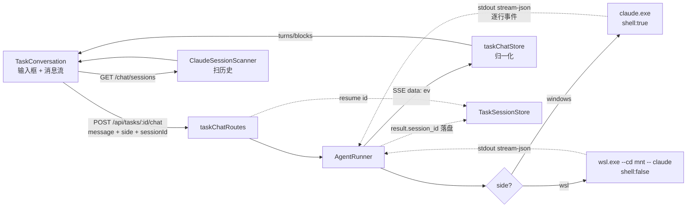
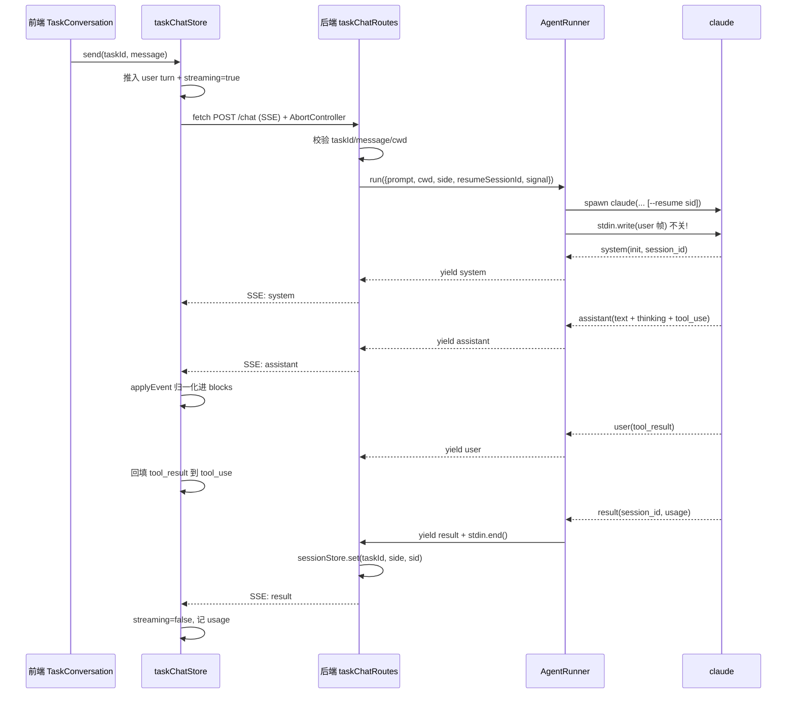

# Claude 实时任务对话 · 实现报告(详解)

> 本文档讲 **ai-task-flow 里「任务实时对话」功能实际怎么实现的、为什么这么做、踩了什么坑**。读完能完整复刻这个功能。通用原理(为什么 stdin pipe、stream-json 协议细则)见知识库 [后端 spawn Claude CLI 通用方案](../knowledge-base/技术方案/工具流程/20260725010000_后端spawn-Claude-CLI通用方案.md)。

---

## 一、功能概述(来龙去脉)

### 1.1 要解决什么

原来 ai-task-flow 是「MCP 拉模型」:用户自己在终端跑 claude,通过 MCP 工具 `get_task`/`record_result` 拉任务、回写状态。后端被动簿记。

痛点:
- 必须切到终端,网页看板和 claude 割裂
- 看不到 claude 的思考/工具调用过程(只看到最终结果回写)
- 用户主力在 WSL,但无法在网页里直接用 WSL 的 claude

### 1.2 做了什么

任务看板每个任务一个「对话」tab。用户网页输入消息 → 后端以**任务仓库为工作目录** spawn Claude Code CLI(headless)→ stream-json 流式回传 → 网页实时渲染(文本 / 思考 / 工具调用)。支持 **Windows / WSL 两侧 claude 切换** + 历史会话恢复。

### 1.3 与 MCP 通道的关系(重要)

对话功能是**旁路通道**:

| 通道 | 写 tasks.json | 转状态机 | 用途 |
|---|---|---|---|
| MCP(原有) | ✅ | ✅ | 用户终端跑 claude,正式执行任务、回写状态 |
| 对话(新增) | ❌ | ❌ | 网页里临时聊、问问题、试方案,不影响任务状态 |

两条通道共存。对话里聊的内容不会污染任务状态——想正式回写,仍走 MCP。

---

## 二、整体架构



### 分层与文件清单(DDD 四层)

| 层 | 文件 | 行数 | 职责 |
|---|---|---|---|
| interfaces/http | `backend/src/interfaces/http/routes/taskChatRoutes.ts` | ~145 | SSE 端点、taskId 校验、AbortController 中断、历史会话路由 |
| application/agent | `backend/src/application/agent/AgentRunner.ts` | ~230 | spawn claude、stdin 写、事件过滤透传、生命周期 |
| infrastructure/persistence | `backend/src/infrastructure/persistence/TaskSessionStore.ts` | ~56 | `taskId → {windows?, wsl?}` 按侧存 sessionId |
| infrastructure/system | `backend/src/infrastructure/system/ClaudeSessionScanner.ts` | ~600 | 扫历史会话、加载时间线(跨 Win/WSL home) |
| 前端 store | `frontend/src/stores/taskChatStore.ts` | ~330 | SSE 拉取、stream-json 归一化、状态机 |
| 前端组件 | `frontend/src/components/board/TaskConversation.tsx` | ~350 | 渲染 + 交互 |
| 前端组件 | `ThinkingCard.tsx` / `ToolUseCard.tsx` | 小 | block 卡片 |
| 前端 UI | `frontend/src/components/ui/popover.tsx` | 小 | radix Popover(shadcn) |
| 共享类型 | `shared/src/types/agent.ts` | 小 | 事件 / block / turn 类型 |

---

## 三、完整数据流(每一步发生了什么)



**关键节点解释**:
- 前端 `send` 立即推入 user turn(乐观渲染),并设 `streaming=true`(输入框禁用、按钮变停止)。
- 后端 SSE:每个事件用 `data: ${JSON}\n\n` 推一行,前端 `ReadableStream` 逐帧解析。
- AbortController:前端点停止 → abort fetch → 后端 `request.raw.on('close')` → `agentRunner` 的 signal → kill claude。
- 收尾:`result` 事件落盘 sessionId(下轮 resume)+ 关 stdin(claude 退出)。

---

## 四、后端实现详解

### 4.1 AgentRunner —— 两侧统一,差异最小

`buildSpawn(side)` 返回 spawn 参数。两侧唯一差异:

| | Windows | WSL |
|---|---|---|
| command | `claude`(或 `CLAUDE_EXECUTABLE` 环境变量) | `wsl.exe` |
| argv | `claude ...args` | `--cd <mnt> -- claude ...args` |
| cwd / settings | Windows 路径 | `toWslPath` 转 `/mnt/...` |
| shell | `true`(Windows claude 是 .cmd shim,需 shell 解释) | `false` |
| stdio | `['pipe','pipe','pipe']` | 同 |

**关键设计**:prompt 处理、事件读取、生命周期**完全一致**,side 只影响 spawn 形态。这样协议层逻辑只写一份。

### 4.2 stdin 生命周期(最关键)

```ts
// 写 prompt(两侧都走 stdin pipe)
const envelope = JSON.stringify({
  type: 'user',
  message: { role: 'user', content: [{ type: 'text', text: opts.prompt }] },
}) + '\n';
child.stdin.write(envelope);   // 写完不关!

// 按行读 stdout
for await (const line of createInterface({ input: child.stdout })) {
  const ev = JSON.parse(line);
  if (!shouldKeep(ev)) continue;        // 过滤噪音
  yield ev;                              // 透传给路由
  if (ev.type === 'result') {
    child.stdin.end();                   // ✅ 收到 result 才关
    break;
  }
}
```

> 为什么不能写完就 `end()`:stream-json 模式 stdin 是持续双向流,claude 可能发 control_request 等父进程回 control_response。早关 = 静默退出。详见通用方案第五节。

### 4.3 事件过滤(shouldKeep)

```ts
function shouldKeep(ev: AgentEvent): boolean {
  if (ev.type === 'assistant' || ev.type === 'user' || ev.type === 'result') return true;
  if (ev.type === 'system' && ev.subtype === 'init') return true;
  return false;   // log / hook_* / thinking_tokens / 其他 system 子类型 → 噪音丢弃
}
```

control_request 当前**不透传但 warn 留痕**(bypassPermissions 下罕见,完整 auto-approve 待实现)。

### 4.4 错误处理与进程清理

```ts
} finally {
  clearTimeout(timer);
  opts.signal?.removeEventListener('abort', onAbort);
  // 先断 stdio(WSL 下 kill wsl.exe 不杀 claude,断 stdin 让 claude 收 EOF 自退)
  try { child.stdin?.destroy(); child.stdout?.destroy(); child.stderr?.destroy(); } catch {}
  if (!child.killed && child.exitCode === null) child.kill();
}

// 退出但没收到 result(异常)→ 给前端带 stderr 的错误
if (!gotResult) {
  const stderr = stderrTail.trim();
  yield { type: 'error',
    message: stderr ? `claude exited (code=${exitCode})\n${stderr.slice(-300)}` : `claude exited (code=${exitCode})`,
    stderr };
}
```

**为什么 message 拼 stderr**:前端只读 `ev.message`。不拼的话用户只看到 `exit code=127`,分不清是 claude 没装还是 WSL 没起。

### 4.5 TaskSessionStore —— 按侧存 sessionId

存储格式 `~/.ai-task-flow/task-sessions.json`:

```json
{
  "TASK-004": {
    "windows": "2ac9a30a-2e04-447c-a3b5-c31d1b06c9e3",
    "wsl":     "339e6a4b-b41d-495c-9f2d-787a70ea1e35"
  }
}
```

- `get(taskId, side)` / `set(taskId, side, sid)`
- **向后兼容**:旧扁平 `taskId → "sid"` 字符串加载时归一为 `{windows: sid}`(旧数据全是 Windows 侧)
- catch 区分 ENOENT(首次运行,正常空态)vs 损坏(告警 + 重置,不阻断对话)

### 4.6 ClaudeSessionScanner —— 跨 home 扫历史

claude 每个会话存 `<home>/.claude/projects/<encoded-cwd>/<sessionId>.jsonl`。扫描器要同时找:
- Windows home:`C:\Users\<user>\.claude\projects\`
- 各 WSL distro home:`\\wsl.localhost\<distro>\home\<user>\.claude\projects\`

按 sessionId 去重合并(两侧可能扫到同一个)。`loadTimeline` 解析 jsonl 为前端可渲染的 turns/blocks(与实时流归一化形态一致)。

> 安全:`findSessionFile` 入口校验 sessionId `/^[A-Za-z0-9-]+$/`(它来自 URL,直接拼 `${sid}.jsonl` 会路径穿越)。

### 4.7 taskChatRoutes —— SSE 端点 + 中断

```ts
reply.raw.writeHead(200, { 'Content-Type': 'text/event-stream', ... });
const abortController = new AbortController();
const onClose = () => abortController.abort();
request.raw.on('close', onClose);
try {
  for await (const ev of agentRunner.run({ prompt, cwd, side, resumeSessionId, signal: abortController.signal })) {
    if (!reply.raw.writableEnded) reply.raw.write(`data: ${JSON.stringify(ev)}\n\n`);  // 卫语句防已断开
    if (ev.type === 'result' && typeof ev.session_id === 'string') {
      await sessionStore.set(task.id.value, side, ev.session_id);
    }
  }
} finally {
  request.raw.off('close', onClose);
  if (!reply.raw.writableEnded) reply.raw.end();   // 卫语句
}
```

---

## 五、WSL 踩坑三天全过程(本项目最大难点)

按时间顺序记录每次尝试、现象、诊断、结论,团队别再走一遍:

| # | 尝试 | 现象 | 当时诊断 / 误判 | 最终结论 |
|---|---|---|---|---|
| ① | `wsl.exe -- claude` + Node stdin pipe 写 prompt | 粗测「写进去 claude 没收到」 | **误判 wsl.exe 不转发 stdin** | 错!测试没给子进程启动时间 |
| ② | 改 `< file` 重定向(`claude ... < prompt.json`) | claude **静默 exit 0,stdout 完全空白**,间歇成功 | 以为 bash 脚本/参数问题 | 真正根因,但当时没意识到 |
| ③ | 加 bash 脚本文件包装(绕 `bash -c` 引号) | bash 通(echo 回显)、claude 在 `/usr/bin/claude`,但 claude 仍静默退出 | 锁定是 claude 本体,非基础设施 | 排除了 bash 层,聚焦 claude |
| ④ | 查 multica 源码 + 重新实测 | multica 用 **stdin pipe**(非 file);`cat` 实测 wsl.exe **确实转发** stdin | 根因浮现 | **`< file` 读完 EOF,stream-json 期望持续流 → 静默退出** |

**根因**:stream-json 模式下 claude 的 stdin 是持续双向流(可能发 control_request 等父进程回 control_response)。`< file` 文件读完立即 EOF → claude 误判会话结束 → 静默 exit 0。

**最终方案**:直接 `wsl.exe --cd <mnt> -- claude <args>` + stdin pipe(与 Windows 侧完全统一)。删掉为 `< file` 方案服务的三个函数(`writePromptFile`/`writeWslRunScript`/`shSingle`)。

**验证**:WSL e2e 对话,事件序列 `system(init) → assistant → text → result(success)`,resume 历史 session `339e6a4b` 成功。

**经验教训**:
1. 第一次没解决就查资料 / 参考成熟项目(multica),别一直试错;
2. 「不转发 stdin」这种结论要用最简单的 `cat` 实测验证,别基于复杂测试下判断;
3. 静默 exit 0 + 间歇成功 = 八成是 EOF/流生命周期问题。

---

## 六、前端实现详解

### 6.1 stream-json 归一化(taskChatStore.applyEvent)

把后端透传的事件流归一化为 `turns[]`,每 turn 含 `blocks[]`。核心算法:

```ts
function applyEvent(turns: Turn[], ev: AgentEvent): Turn[] {
  if (ev.type === 'assistant') {
    // 末尾是 assistant 轮则复用,否则新建
    // 遍历 message.content[],按 type 归一化:
    //   text     → 合并到最后一个 text 块(避免碎片)
    //   thinking → 同上
    //   tool_use → 同 id 更新 input,否则新增(留 id 给 tool_result 回填)
  }
  if (ev.type === 'user') {
    // tool_result:按 tool_use_id 找到对应 tool_use 块,回填 result
  }
  return turns;
}
```

| block kind | 来源 | 合并策略 | 为什么 |
|---|---|---|---|
| `text` | assistant.content[type=text] | 追加合并到末尾 text 块 | 流式分片,不合并会碎成几十个小气泡 |
| `thinking` | assistant.content[type=thinking] | 同上 | 同上 |
| `tool_use` | assistant.content[type=tool_use] | 同 id 更新,否则新增 | input 可能分片到达 |
| tool_result | user.content[type=tool_result] | 按 tool_use_id **回填** | UI 上工具卡片要显示执行结果 |

### 6.2 send 状态机

```ts
send: async (taskId, message) => {
  // 1. 乐观:推入 user turn + streaming=true
  // 2. new AbortController(停止用)
  // 3. for await (ev of streamTaskChat(...)) 处理:
  //      result  → 落 sessionId + usage,streaming=false
  //      error   → 显示错误,streaming=false
  //      其他    → applyEvent 归一化进 blocks
  // 4. catch:AbortError(用户主动停)不报错,保留已生成内容
}
```

### 6.3 交互细节(借鉴 multica + 线上产品)

| 细节 | 实现要点 | 为什么这么做 |
|---|---|---|
| Enter 发送 / Shift+Enter 换行 | `onKeyDown` 判断 `e.key==='Enter' && !shiftKey && !isComposing` | 行业默认(Cursor/Cline/ChatGPT);`isComposing` 防中文输入法误触 |
| 发送键变停止 | streaming 时按钮从 `ArrowUp` 变 `Square`,onClick 从 send 变 stop | 同一位置,肌肉记忆;stop → abort fetch → 后端 kill claude |
| 「思考中」三点动画 | `blocks.length===0 && streaming` 时显示呼吸点,放消息流内 | 不压在按钮上,不挡输入 |
| 近底部才跟随滚动 | `nearBottomRef`,滚动距底 <120px 才 `scrollTo` | 用户上翻看历史时,新内容不被强制拉回底部 |
| 过程折叠(ProcessFold) | thinking/tool_use 折成「N 步」,流式展开、完成自动收 | 突出最终答案(借鉴 multica splitTimeline:preface/middle/final 三段) |
| 历史会话面板 | radix `Popover`(side=top),弃自写浮层 | 自写浮层无点外关闭/键盘/portal;UI 库原语完整 |
| Win/WSL 切换 | segmented 两按钮,切侧清对话(不同 session 池) | 防止拿 Windows sid 去 resume WSL claude |
| 列表 key | tool_use 用其 id,其余 `kind-${i}` | blocks 流式归并后 append-only、顺序稳定,故 `kind-序号` 可作稳定 key(规范禁止裸下标,此处因顺序稳定破例) |

### 6.4 ProcessFold 三段切分(借鉴 multica)

把 assistant 一轮的 blocks 切成三段:

| 段 | 内容 | 渲染 |
|---|---|---|
| preface | 首个非文本块之前的 text | 直接显示(开场白) |
| middle | 首末过程块之间的全部(thinking/tool_use) | 折叠成「N 步」 |
| final | 末个过程块之后的 text | 直接显示(最终答案,突出) |

---

## 七、数据结构示例

**前端 turns/blocks**:

```jsonc
[
  { "id": "u1", "role": "user", "text": "看下 package.json" },
  { "id": "a1", "role": "assistant", "blocks": [
    { "kind": "text", "text": "我来看看" },
    { "kind": "tool_use", "id": "toolu_01", "name": "Read",
      "input": { "file_path": "..." },
      "result": { "content": "...", "isError": false } },
    { "kind": "text", "text": "这是 Node 项目..." }
  ]}
]
```

---

## 八、验证

WSL 侧端到端测试(`reply with exactly: ok`):

| 事件序列 | 说明 |
|---|---|
| `system`(init, session_id=339e6a4b) | resume 历史会话成功 |
| `assistant` → `text` | 模型回复 |
| `result`(subtype=success) | 闭环完成 |

Windows 侧逻辑相同(更简单,无 wsl.exe 层)。

---

## 九、已知问题与待办

| 项 | 影响 | 优先级 | 待办 |
|---|---|---|---|
| control_request 未 auto-approve | bypassPermissions 下罕见;若发生挂 10min timeout | P1 | 对齐 multica `handleControlRequest` 回 allow |
| resume 被拒绝无自动重试 | 报错需手动重发 | P2 | 检测 `no conversation found`,丢 sid 重试 |
| WSL 侧 MCP/skills 清不掉 | token 偏高 | P2 | trade-off(--settings 合并非替换) |
| AgentRunner 在 application 层 | 唯一直接 spawn 的 application 类,边界偏 infrastructure | P3 | 再有第 2 个 runner 时抽 infrastructure/agent/ |

---

## 十、关联文档

- 通用原理:[后端 spawn Claude CLI 通用方案](../knowledge-base/技术方案/工具流程/20260725010000_后端spawn-Claude-CLI通用方案.md)
- 实施计划:`docs/plans/20260724214431_Claude实时对话_实施计划.md`
- 项目提升(对话上线后的辐射改动):[对话主功能上线后 · 项目提升计划](./20260725030000_对话主功能上线后-项目提升计划.md)
