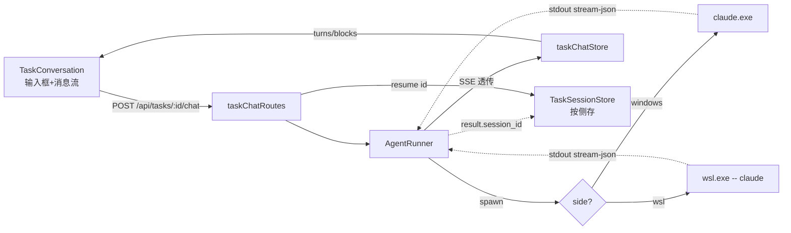

# Claude 实时任务对话 · 实现报告

> 本文档讲「ai-task-flow 里任务实时对话功能**实际怎么实现的、为什么这么做、踩了什么坑**」。通用原理见知识库 [后端 spawn Claude CLI 通用方案](../knowledge-base/技术方案/工具流程/20260725010000_后端spawn-Claude-CLI通用方案.md)。

## 一、功能概述

任务看板每个任务一个「对话」tab。用户在网页输入消息 → 后端以**任务仓库为工作目录** spawn Claude Code CLI(headless)→ stream-json 流式回传 → 网页实时渲染(文本/思考/工具调用)。支持 **Windows / WSL 两侧 claude 切换** + 历史会话恢复。

**定位**:旁路通道——不写 tasks.json、不转任务状态机(状态回写仍走 MCP)。两条通道共存。

## 二、架构与数据流



| 层 | 文件 | 职责 |
|---|---|---|
| http | `backend/src/interfaces/http/routes/taskChatRoutes.ts` | SSE 端点、taskId 校验、AbortController 中断 |
| application | `backend/src/application/agent/AgentRunner.ts` | spawn claude、stdin 写、事件过滤透传、生命周期 |
| persistence | `backend/src/infrastructure/persistence/TaskSessionStore.ts` | `taskId → {windows?, wsl?}` 按侧存 sessionId |
| system | `backend/src/infrastructure/system/ClaudeSessionScanner.ts` | 扫历史会话、加载时间线(跨 Win/WSL home) |
| 前端 | `frontend/src/stores/taskChatStore.ts`、`components/board/TaskConversation.tsx` | SSE 拉取、归一化、渲染、交互 |

## 三、后端实现要点

### 3.1 AgentRunner:统一两侧,差异最小

`buildSpawn(side)` 返回 spawn 参数,两侧唯一差异是 command / cwd 翻译 / shell,stdio 处理完全一致:

| | Windows | WSL |
|---|---|---|
| command | `claude`(或 `CLAUDE_EXECUTABLE`) | `wsl.exe` |
| argv | `claude ...args` | `--cd <mnt> -- claude ...args` |
| cwd/settings | Windows 路径 | `toWslPath` 转 `/mnt/...` |
| shell | true(兼容 .cmd shim) | false |
| stdio | `['pipe','pipe','pipe']` | 同 |

### 3.2 为什么这么设计

| 决策 | 本项目原因 |
|---|---|
| prompt 走 stdin pipe | stream-json 双向流,file 重定向会 EOF 静默退出(见第四节踩坑) |
| `--settings clean.json` | 隔离用户级 superpowers hook,单轮 input 35k→2.5k |
| `bypassPermissions` | headless 无 UI,网页里没法弹权限框 |
| 按 side 存 sessionId | 用户主力 WSL,两套 claude 不同 home,跨侧 resume 报错 |
| 旁路不写 tasks.json | 对话是辅助,不污染任务状态机(状态仍走 MCP) |

## 四、WSL 实现与踩坑(本项目最大难点)

**踩坑过程(三天)**:

| 尝试 | 结果 | 误判 |
|---|---|---|
| ① `wsl.exe -- claude` + stdin pipe | 粗测「写进去没收到」 | 误判 wsl.exe 不转发 stdin(实为测试没给启动时间) |
| ② 改 `< file` 重定向 | claude **静默 exit 0,无输出**,间歇成功 | 以为脚本/bash 问题,绕了一圈 |
| ③ bash 脚本包装 | bash 通、claude 在 PATH,仍静默退出 | 才锁定是 claude 本体 |
| ④ 查 multica + 实测 | multica 用 stdin pipe;cat 实测 wsl.exe **转发** stdin | 根因:`< file` 读完 EOF,stream-json 期望持续流 |

**最终方案**:直接 `wsl.exe --cd <mnt> -- claude <args>` + stdin pipe(与 Windows 侧统一),删掉为 `< file` 服务的 `writePromptFile`/`writeWslRunScript`/`shSingle`。

**验证**:WSL 对话 e2e,事件序列 `system(init) → assistant → text → result(success)`,resume 历史 session `339e6a4b` 成功。

## 五、前端实现

### 5.1 stream-json 归一化(taskChatStore)

事件流 → `turns[]`,每 turn 含 `blocks[]`:

| block | 来源 | 合并 |
|---|---|---|
| text | assistant.content[text] | 追加合并到末尾 text 块 |
| thinking | assistant.content[thinking] | 同上 |
| tool_use | assistant.content[tool_use] | 同 id 更新,否则新增 |
| tool_result | user.content[tool_result] | 按 tool_use_id 回填到对应 tool_use |

### 5.2 交互细节(借鉴 multica + 线上产品)

| 细节 | 实现 | 为什么 |
|---|---|---|
| Enter 发送/Shift+Enter 换行 | onKeyDown 判断 | 行业默认 |
| 发送键变停止 | ArrowUp↔Square morph + AbortController | 同位置肌肉记忆;abort → 后端 kill claude |
| 「思考中」三点动画 | 放消息流内,不压按钮 | 不挡输入 |
| 近底部才跟随滚动 | `nearBottomRef` 阈值 120px | 上翻看历史不被拉回 |
| 过程折叠 | thinking/tool_use 折成「N 步」,完成自动收 | 突出最终答案(借鉴 multica splitTimeline) |
| 历史会话面板 | radix Popover(side=top) | **弃自写浮层**——交互烂,改用 UI 库原语 |
| Win/WSL 切换 | segmented,切侧清对话 | 不同 session 池,防跨侧 resume |

## 六、数据结构

**sessionId 存储**(`~/.ai-task-flow/task-sessions.json`):

```json
{
  "TASK-004": {
    "windows": "2ac9a30a-...",
    "wsl": "339e6a4b-..."
  }
}
```

旧扁平 string 格式加载时归一为 `{windows: string}`(向后兼容)。

**历史会话扫描**:`ClaudeSessionScanner` 跨 Windows `%USERPROFILE%` + WSL `\\wsl.localhost\` 两个 home、两种路径编码找 `<sessionId>.jsonl`,按 sessionId 去重。

## 七、已知问题与待办

| 项 | 影响 | 待办 |
|---|---|---|
| control_request 未 auto-approve | bypassPermissions 下罕见,发生则挂 10min timeout | 对齐 multica 实现 handleControlRequest |
| resume 拒绝无自动重试 | 报错需手动重发 | 检测 `no conversation found` 丢 sid 重试 |
| WSL 侧 MCP/skills 清不掉 | token 偏高 | trade-off |
| AgentRunner 在 application 层 | 唯一直接 spawn,边界偏 infrastructure | 再有 runner 时抽 infrastructure/agent/ |
| control_request 透传 | 当前 warn 留痕 | 完整协议实现 |

## 八、关键文件清单

| 文件 | 行数级 | 说明 |
|---|---|---|
| `backend/src/application/agent/AgentRunner.ts` | ~230 | spawn + stdin + 事件透传 + 生命周期 |
| `backend/src/infrastructure/persistence/TaskSessionStore.ts` | ~56 | 按侧存 sid |
| `backend/src/interfaces/http/routes/taskChatRoutes.ts` | ~145 | SSE 端点 + 历史会话路由 |
| `backend/src/infrastructure/system/ClaudeSessionScanner.ts` | ~600 | 扫描 + 时间线解析 |
| `frontend/src/stores/taskChatStore.ts` | ~330 | 归一化 + 状态机 |
| `frontend/src/components/board/TaskConversation.tsx` | ~350 | 渲染 + 交互 |
| `frontend/src/components/board/ThinkingCard.tsx` / `ToolUseCard.tsx` | 小 | block 卡片 |
| `frontend/src/components/ui/popover.tsx` | 小 | radix Popover(shadcn) |
| `shared/src/types/agent.ts` | 小 | 事件/block/turn 类型 |
