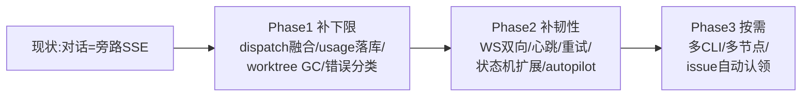
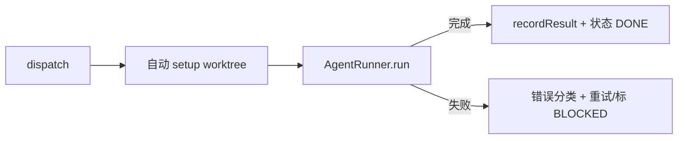
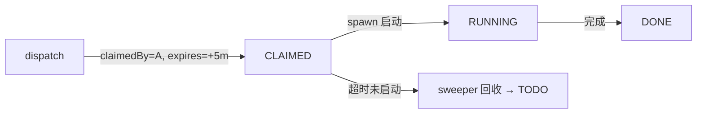
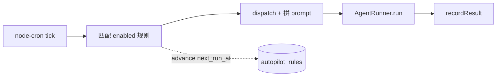

# 对话主功能上线后 · 项目提升计划

> **背景**:「任务实时对话」(后端 spawn Claude CLI)已上线,但这只是 multica 这类成熟产品里**整套配套生态**的一个点。本文对照 multica(`D:\study\multica`,Go daemon+server,围绕 spawn 建立生产级全套)梳理:对话主功能上线后,**围绕它其他功能需要做什么改动、要不要改、按什么优先级改**。
>
> 通用 spawn 原理见知识库 [后端 spawn Claude CLI 通用方案](../knowledge-base/技术方案/工具流程/20260725010000_后端spawn-Claude-CLI通用方案.md);本次对话实现见 [实现报告](./20260725020000_Claude实时任务对话_实现报告.md)。

---

## 一、核心判断(先看结论)

对话功能现在是**旁路通道**(不写 tasks.json、不转状态机)。要让它从「能聊」变成「能正经执行任务」,关键缺口是 **dispatch 与 spawn 融合 + usage 落库 + worktree 回收 + 错误分类** 这四个 P0。其余(WS、autopilot、多 CLI、多节点)是「好用」到「强大」的增量,按需取舍。



---

## 二、全景对比(multica vs ai-task-flow)

| 维度 | multica(成熟) | ai-task-flow(现状) | 差距 |
|---|---|---|---|
| 实时推送 | 双 WS 通道 + Redis 跨节点中继 | SSE 单向 + 文件轮询 | 大 |
| 任务领取 | WS push 优先 + HTTP poll 兜底 + claim 租约 | MCP 拉(被动),无 claim | 大 |
| 心跳/控制 | 15s heartbeat + 捎带 actions + RuntimeGone 恢复 | 无 | 大 |
| 自动编排 | cron autopilot 调度 Job | 无 | 中 |
| 多 CLI | 17 个 Backend 适配器 + 工厂 | 单 claude 硬编码 | 中(YAGNI) |
| 执行隔离 | worktree + 进程隔离 helper + GC meta | worktree 有、无回收、无进程隔离 | 中 |
| 用量追踪 | daemon 上报 + DB 权威成本 + 小时分桶 rollup | 扫 jsonl + 估算成本,与 task 关联弱 | 中 |
| 状态机 | queued/dispatched/running/waiting/cancelled/... | 4 态(TODO/IN_PROGRESS/DONE/BLOCKED) | 中 |
| 错误处理 | 14 类分类 + 可重试白名单 + 退避 | 无分类、无重试 | 中 |
| 前端展示 | Virtuoso + React Query 缓存 + timeline 着色 | 自实现(已相当完善,同级) | 小 |

> **关键认知**:ai-task-flow 的**前端展示已和 multica 同级**(甚至 ToolUseCard 关键入参摘要更直观),**架构简洁易上手**也是优势。差距集中在**后端配套**(推送、领取、状态、计费、韧性),不是前端。

---

## 三、逐维度提升项(每项:现状 → 目标 → 怎么改 → 优先级)

### 3.1 任务 dispatch 与 spawn 通道融合【P0】

**现状**:dispatch 后用户还要手动开 claude;MCP 拉模型与 spawn 通道完全割裂。对话通道是旁路,不写状态机。

**目标**:dispatch 后**后端自动 spawn claude**执行任务,MCP 保留为「手动操作入口」。



**怎么改**:`taskChatRoutes.ts` 从「只 SSE 透传」改为「写状态机(→ IN_PROGRESS)+ 自动 worktree setup + spawn」。`recordResult` 接 spawn 的 result。
**工作量**:3-5 天(涉及状态机 + 前端按钮语义改动)。

### 3.2 任务租约 / claim【P1】

**现状**:同一任务被多个 claude 进程同时拉,没有租约/锁。

**目标**:派发时给 `claimedBy` + `claimExpiresAt`,后台 sweeper 回收过期租约。



**怎么改**:`Task` 实体加 lease 字段,后台 sweeper 定时回收。
**工作量**:1-2 天。

### 3.3 任务状态机扩展【P1】

**现状**:4 态,IN_PROGRESS 同时表示「已派发未启动」「运行中」「暂停」,语义模糊。

**现状 vs 扩展**:

| 现状(4 态) | 扩展后 | 说明 |
|---|---|---|
| TODO | TODO | 待派发 |
| — | **CLAIMED** | 已派发但 spawn 未启动 |
| IN_PROGRESS | **RUNNING** | spawn 运行中 |
| — | **CANCELLED** | 用户主动取消 |
| DONE | DONE | 完成 |
| BLOCKED | BLOCKED | 阻塞 |

**怎么改**:`TaskStatus.ts` 加三态 + 调整 `isValidTransition` 矩阵 + 前端 pill 配色。
**工作量**:1-2 天。

### 3.4 实时推送升级(SSE → WS)【P1】

**现状**:SSE 单向(只能 server→client);后端无法主动推送 spawn 中断信号/heartbeat actions;文件轮询全量重拉。

**目标**:全双工 WS,后端可主动推中断/心跳;按 taskId scope 订阅。

**怎么改**:后端 `ws` 库 + Hub(`Map<taskId, Set<conn>>`),前端 ws-client(指数退避重连),迁移现有 SSE,buffer/debounce。
**工作量**:3-5 天。Redis 多节点中继(P2,2-3 天,仅多副本时)。

### 3.5 spawn 进程心跳 + 后端主动 kill【P1】

**现状**:spawn 一次跑完即终止,无 health 监控;非客户端主动情况(超时、关页面再开)无法 kill 跑飞的 claude。

**目标**:AgentRunner 定期发 `AgentHeartbeat(taskId, status, lastEventAt)`;PID 注册到 store,新增 `POST /chat/kill` 按 PID kill;30s 无心跳标 stale。

**怎么改**:`TaskSessionStore` 加 PID 映射;新路由 kill;Sweeper 检测 stale。
**工作量**:2 天。

### 3.6 用量追踪强化【P0 + P1】

**现状**:扫本机 jsonl 估算成本,与 task 关联弱(只靠 cwd→project),无权威成本、无 rollup。

| 项 | 现状 | 提升 | 优先级 |
|---|---|---|---|
| spawn 结束 usage 落库 | result 事件有 usage 但**未持久化** | 落 `usage.json` / task record | **P0** |
| task ↔ usage 关联 | 靠 cwd | spawn 时写 sessionId→taskId 映射 | P1 |
| 按天 rollup | 每次扫全量 jsonl | 5min 定时累加到 `usage_daily` | P1 |
| 失败任务 usage | 失败时丢 | error 兜底落部分 usage | P2 |

**工作量**:P0 落库 1 天;其余各 0.5-1 天。

### 3.7 worktree 自动回收【P0】

**现状**:worktree 创建齐(`WorktreeManager.ts`),但 `recordResult` **不清理**——只能手动 destroy;无 GC。

**目标**:Task 加 `autoCleanupWorktree`,完成时自动 destroy;GC sweeper 定期清已完成 >N 天的 worktree。

**怎么改**:`Task` 加字段;`recordResult` 条件调 `WorktreeManager.destroy`;sweeper 定时任务。
**工作量**:1 天。

### 3.8 错误分类 + 自动重试【P0 + P1】

**现状**:spawn 失败就失败,无分类、无重试、前端只能手动重发。

**目标**:抽 `ErrorClassifier`,正则匹配常见错误,可重试类自动退避重试。

| 错误类 | 示例 | 可重试 |
|---|---|---|
| `context_overflow` | context too long | ❌ |
| `quota_exceeded` | rate limit / 配额 | ✅(退避) |
| `provider_network` | timeout / connection | ✅(3 档退避) |
| `permission_denied` | 权限 | ❌ |
| `unknown` | 其他 | ❌ |

**怎么改**:`ErrorClassifier.ts` 分类;对 `provider_network`/`timeout` 自动重试 3 次,间隔 [4s,8s,16s](对齐 multica 简化版)。
**工作量**:分类 1 天;重试 1 天。

### 3.9 多 CLI 适配器(为扩展准备)【P1,可推迟】

**现状**:`AgentRunner.ts` argv 全 claude 专属,解析 inline,无抽象。

**目标**:抽 `AgentBackend` 接口,每 CLI 一实现 + 注册表。

```ts
interface AgentBackend {
  readonly name: string;
  buildSpawn(opts: SpawnOpts): ChildProcess;
  parseEvent(line: string): AgentEvent | null;
  buildPromptInput(prompt: string): string;
}
// ClaudeBackend / (将来) CodexBackend / GeminiBackend + backendRegistry
```

**怎么改**:重构 `AgentRunner` → `AgentRunner`(编排) + `ClaudeBackend`(适配)。
**工作量**:1-2 天(抽象);接新 CLI 每个 1-2 天(P2,YAGNI 视需求)。

### 3.10 简单 cron autopilot【P1】

**现状**:无自动编排,任务必须手动派发。

**目标**:node-cron 触发,匹配规则(cron + prompt 模板)→ 自动 dispatch + spawn。



**怎么改**:新表 `autopilot_rules`(cron_expr/prompt_template/enabled/next_run_at);新 `AutopilotScheduler` 服务;前端管理页。
**工作量**:3-5 天。

### 3.11 前端增强【P0 小 + P1】

**现状**:已相当完善(与 multica 同级)。小优化:

| 项 | 提升 | 优先级 |
|---|---|---|
| 流式片段跨 turn 合并 | 更激进合并(multica coalesceTimelineItems) | P0(0.5 天) |
| Virtuoso 虚拟滚动 | 长对话不卡 | P1(1 天) |
| turns 持久化 | localStorage / 后端,刷新不丢 | P1(1-2 天) |
| timeline type 着色 | thinking 紫/tool 蓝/result 灰/error 红 | P2(0.5 天) |

---

## 四、提升路线图(分阶段)

### Phase 1:补下限——从「能跑」到「能用」(约 2 周,P0 为主)

让 spawn 通道从「旁路 SSE 透传」变成「正经任务执行流」。

| 优先级 | 项目 | 工作量 |
|---|---|---|
| **P0** | dispatch 与 spawn 通道融合(派发自动 spawn) | 3-5 天 |
| **P0** | spawn 结束 usage 落库 | 1 天 |
| **P0** | worktree 自动清理 + GC sweeper | 1 天 |
| **P0** | 失败分类器 ErrorClassifier | 1 天 |
| **P0** | 流式片段合并优化(前端) | 0.5 天 |
| P1 | 任务租约 / claim | 1-2 天 |
| P1 | 状态机扩展(CLAIMED/RUNNING/CANCELLED) | 1-2 天 |
| P1 | AgentBackend interface 抽象 | 1-2 天 |

### Phase 2:补韧性——从「能用」到「好用」(约 2 周,P1 为主)

| 优先级 | 项目 | 工作量 |
|---|---|---|
| P1 | SSE → WS 升级(双向) | 3-5 天 |
| P1 | spawn 心跳 + 后端主动 kill | 2 天 |
| P1 | 可重试错误自动重试(退避) | 1 天 |
| P1 | task ↔ usage 关联 + 按天 rollup | 1.5 天 |
| P1 | 简单 cron autopilot | 3-5 天 |
| P1 | Virtuoso 虚拟滚动 + turns 持久化 | 2 天 |

### Phase 3:按需——多 CLI / 多节点(P2,YAGNI 取舍)

| 优先级 | 项目 | 工作量 |
|---|---|---|
| P2 | 接入 codex / gemini-cli | 每个 1-2 天 |
| P2 | Redis pub/sub 多节点中继 | 2-3 天 |
| P2 | stale sweeper + orphan 恢复 | 1.5 天 |
| P2 | issue 自动认领(GitHub webhook) | 2-3 天 |

---

## 五、决策建议(哪些该做,哪些别急)

**强烈建议做**(价值高、代价低):
- ✅ Phase 1 全部 P0(dispatch 融合、usage 落库、worktree GC、错误分类)——这是「能用」的最低门槛
- ✅ 状态机扩展 + 租约——多 claude 并发安全的基础

**建议做但有先后**(Phase 2):
- WS 升级是分水岭,但工作量大,可等 Phase 1 稳定后
- autopilot 单独价值高,可独立排期

**建议缓做 / YAGNI**(Phase 3,除非有明确需求):
- ⏸ 多 CLI 适配——当前只 claude,等真要接 codex 再抽象(可先做 interface 预留)
- ⏸ Redis 多节点——单机够用时不做
- ⏸ issue 自动认领——看产品方向

---

## 六、两项目优势对比(客观)

| multica 的强项 | ai-task-flow 的强项 |
|---|---|
| 生产级 WS 双通道 + Redis 中继 | 架构简洁,单进程 Node + JSON,无 DB/Redis |
| claim 租约 + stale sweeper | MCP 拉模型保留原生 claude code 体验 |
| 失败分类 + 自动重试 + 17 CLI | 前端展示已同级(ThinkingCard/ToolUseCard/ProcessFold) |
| 进程隔离 helper + GC meta | ToolUseCard「关键入参摘要」更直观 |
| DB 权威成本 + rollup | 易上手、易部署 |

**结论**:ai-task-flow 不必照抄 multica 全套(它是多副本生产系统)。**优先补 Phase 1 的 P0**,让 spawn 从旁路变主流;Phase 2 的 WS + autopilot 是下一个里程碑;Phase 3 视产品方向取舍。

---

## 七、参考

- multica 源码:`D:\study\multica\server\`(daemon / daemonws / pkg/agent / scheduler / handler)
- 通用方案:[后端 spawn Claude CLI 通用方案](../knowledge-base/技术方案/工具流程/20260725010000_后端spawn-Claude-CLI通用方案.md)
- 实现报告:[Claude 实时任务对话 · 实现报告](./20260725020000_Claude实时任务对话_实现报告.md)
