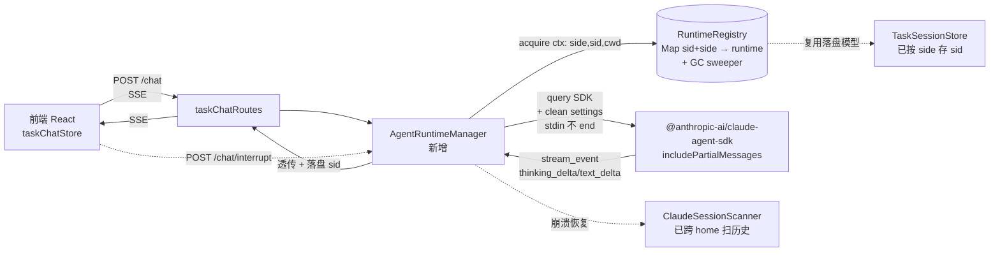

# 对话协同模式升级方案:常驻 Runtime 与流式体验

> **范围**:升级「A 模式 = 人机协同推进」(前端与 Claude 对话,一起推进任务)的**交互速度与体验**。
> **非范围**:不含「B 模式 = 自主派发」(multica 式后台自动跑完)。B 涉及 agent 编写 + 执行准确率,未调研,单独立项。
>
> **来源**:对照本地 `D:\Study\jetbrains-cc-gui`(IntelliJ 插件 + Node ai-bridge + React webview)、`multica`,以及 vibe-kanban / opencode / crush / claudia 等开源项目调研。前置讨论与文档断言排查见文末「相关文档」。
>
> **本版修订**(对照代码核实现状):修正「前端需新写 thinking 渲染」等误判、补全已实现能力清单、Phase 1 降级、Phase 2 补 `side` 维度并明确沿用 clean settings。**Phase 2 核心假设已 spike 实测通过**(冷启动 4098→378ms,见 §5.Phase 2 验证框)。

---

## 一、背景与目标

### 1.1 产品模式定位

项目经「会话化改造」(`docs/20260722172646_任务会话化改造设计方案.md`)后,任务对话走**旁路通道** `POST /api/tasks/:id/chat`:不写 tasks.json、不转状态机,纯协同推进。用户主力工作模式是 **A 模式:打开任务 → 在对话框与 Claude 协同推进**。

### 1.2 核心痛点(用户确认 + 代码根因)

| 痛点 | 现象 | 根因(代码实证) |
|---|---|---|
| 思考阶段空白 | Claude 思考时对话框只有计时器,无内容流 | **后端**未开 `--include-partial-messages`,且 `shouldKeep` 过滤了 `stream_event`;**前端渲染层(ThinkingCard/ProcessFold)就绪,但 `applyEvent` 原无 `stream_event` 分支**(只处理 assistant 终态整块 thinking)——Phase 1 已补 |
| 每轮冷启动慢 | 每发一条消息重新 spawn Claude 进程 | 每轮新 `spawn`(`AgentRunner:118`),无进程复用 |
| 缺控制能力 | 只能 kill 整进程,不能中断单 turn / 切模型 / 看上下文 | 裸 spawn CLI,中断靠 `child.kill('SIGTERM')`(`AgentRunner:152`),拿不到 SDK 控制接口 |
| 缺原生功能 | 无文件/截图上传、无通知、无斜杠命令、刷新丢窗口态 | 前端未实现(但截图/图片落盘基建在 WebClip 线已有,可复用) |

> **澄清**:**SSE 传输不是瓶颈**。A 模式下 SSE 单向 + 旁路 HTTP(stop)够用,WS 是「锦上添花」不是「必需」,本方案**缓做 WS**。

### 1.3 目标

让 A 模式**更快(消除冷启动)、更流畅(思考可见)、更可控(中断/切模型)、更原生(文件/通知/命令)**,体验对标 jetbrains-cc-gui。**前提:最大化复用现有实现,做增量而非重写。**

---

## 二、现状诊断(代码事实)

### 2.1 当前对话链路

```
前端 taskChatStore (fetch 读流)
  → POST /api/tasks/:id/chat  (taskChatRoutes.ts)
    → AgentRunner.run()  spawn claude (AgentRunner.ts)
      → claude stream-json 逐事件
    → SSE 透传  (taskChatRoutes.ts:126)
  → taskChatStore.applyEvent 归一化为 turns/blocks
  → MessageStream 渲染(ThinkingCard / ToolUseCard / ProcessFold)
```

### 2.2 已实现的能力(升级的地基,务必沿用)

| 能力 | 位置 | 说明 |
|---|---|---|
| **前端 thinking 合并(终态)** | `taskChatStore.applyEvent` | assistant **终态**事件的 thinking 整块合并(按 lastBlock 追加)。⚠️ 注:`stream_event` 的逐字增量合并是 Phase 1 新增(见 §5.Phase 1),原 applyEvent 并无 `stream_event` 分支 |
| **过程折叠(ProcessFold)** | `MessageStream:18-73` | preface/middle/final 三段切分,thinking+tool_use 折成「N 步」,流式展开完成自动收(借鉴 multica splitTimeline) |
| **(taskId, side) 续接落盘** | `TaskSessionStore` → `~/.ai-task-flow/task-sessions.json` | 按 `{taskId:{windows?, wsl?}}` 存 sessionId,刷新不丢续接 |
| **Windows/WSL 双侧 side 切换** | `AgentRunner:77-108` | side 只影响 spawn 形态(Windows `shell:true` / WSL `wsl.exe --cd mnt -- claude`),协议层逻辑一份 |
| **clean settings 隔离用户 hooks** | `AgentRunner:51-64` | `--settings` 注入干净 settings(清 hooks/permissions),阻断 superpowers SessionStart 注入(input 35k→2.5k) |
| **stdin 持续 pipe** | `AgentRunner:120-127,179` | prompt 写完不 end,收到 result 才 end——兼容 control_request 双向流 |
| **跨 home 历史扫描** | `ClaudeSessionScanner` | 扫 Windows home + 各 WSL distro home,按 sessionId 去重,`loadTimeline` 还原 turns/blocks(常驻 runtime 崩溃后的恢复底座) |
| **AbortController 中断链路** | 前端 abort → 后端 `request.raw.on('close')` → `signal` → `child.kill` | 完整闭环已有,Phase 2 只需把「杀整进程」升级为「单 turn 中断」 |

### 2.3 现存的缺口(精准化)

| 文件:行 | 现状 | 缺口 |
|---|---|---|
| `AgentRunner.ts:84-91` | `baseArgs` 无 `--include-partial-messages` | 思考不发增量 → 空白 |
| `AgentRunner.ts:45-49` | `shouldKeep` 只留 assistant/user/result/system-init | 开 partial 后的 `stream_event` 会被丢弃 |
| `AgentRunner.ts:118` | 每轮 `spawn` | 无进程复用 → 冷启动 |
| `AgentRunner.ts:123-127` | prompt 纯 `text` content block | 不支持图片/文件多模态 |
| `AgentRunner.ts:152` | `child.kill('SIGTERM')` | 只能杀整进程,不能单 turn 中断 |
| `AgentRunner.ts:171-173` | `control_request` 只 warn 不转发 | AskUserQuestion 等无法回前端 |
| `taskChatStore.ts:294-313` | usage 存内存 | 刷新即丢(sessionId 已落盘,但 usage 未落) |

### 2.4 文档盲区

`docs/20260725030000_对话主功能上线后-项目提升计划.md` 讲了 dispatch 融合 / WS / usage / worktree GC / 错误分类,但**完全没提「常驻 runtime 管理」这层**——而这恰是优秀产品拉开体验差距的核心(见第三章)。本方案补这个盲区。

> 另:该文档部分现状断言不准确(dispatch 接口已随会话化改造移除、「文件轮询」实为按需拉、turns 持久化误述为待做),实施时以其**架构判断**为准、**现状措辞**需对照代码,勿照搬。

---

## 三、核心洞察:一条分水岭

**所有体验好的产品(vibe-kanban / opencode / crush / jetbrains-cc-gui)都用 Claude Agent SDK 的「常驻 runtime」,不是裸 spawn CLI。**

| 维度 | 裸 spawn CLI(本项目现状 / claudia) | Agent SDK 常驻 runtime(优秀产品) |
|---|---|---|
| 冷启动 | 每轮新进程 | 跨 turn 保活,秒级续接 |
| 思考可见 | 靠 `--include-partial-messages`(易漏) | `includePartialMessages` 原生 |
| 中途控制 | 只能 kill 整进程 | `query.interrupt()` 中断单 turn、会话不死 |
| 切模型/权限 | 要重启进程 | `setModel()` / `setPermissionMode()` 热切换 |
| 上下文占用 | 看不到 | `getContextUsage()` 实时 |
| 预热 | 无 | `preconnect` 首条零延迟 |

> **反面教材 claudia**:漏掉 partial flag + 每轮 respawn → Issue #71「spinner 转不出流」+ 冷启动慢。
> **正面样本 jetbrains-cc-gui**:`ai-bridge/services/claude/persistent-query-service.js` + `runtime-registry.js` 给出了生产级实现,是本方案中期阶段的主要借鉴。
>
> **本项目已具备的迁移基础**:clean settings 隔离、stdin 持续 pipe、(taskId, side) 续接落盘、跨 home 历史扫描——这些 jetbrains 也有、我们也有的「脏活」已做完,迁移 SDK 时**直接沿用**,不用重造。

---

## 四、目标架构



**三层变化(全部建立在 §2.2 已实现能力之上)**:
1. **后端 runtime 层(新增)**:`AgentRuntimeManager` + `RuntimeRegistry`,常驻 SDK query,**沿用 clean settings + stdin pipe**;注册表按 `(sessionId, side)` 维度,**复用 TaskSessionStore 的按侧落盘模型**;GC 借鉴 jetbrains。
2. **传输层(基本不动)**:SSE 保留;新增 `POST /chat/interrupt` 旁路 HTTP 做控制(已有 AbortController 链路,只是后端动作从 kill 换 interrupt)。
3. **前端层(增强,非重写)**:Phase 1 加 delta→block 适配(渲染层已就绪);Phase 3 补 provider / AskUser 弹窗 / 通知 / 文件上传。

---

## 五、分阶段实施计划

### Phase 1【P0 · ✅ 已实施 2026-07-25】思考流式(后端 flag + 前端增量合并 + 终态去重)

**实施结果**(对照原计划的关键修正:原以为「前端已就绪、只动后端」,实测 `applyEvent` 原无 `stream_event` 分支,前端需新增增量合并 + 终态去重):

| 改动 | 位置 | 说明 |
|---|---|---|
| ✅ spawn 加 partial flag | `AgentRunner.baseArgs` | 增 `--include-partial-messages`(两侧 claude ≥2.1.205:Windows 2.1.218 / WSL 2.1.220) |
| ✅ shouldKeep 透传 | `AgentRunner.shouldKeep` | 只放行 `stream_event` 的 `thinking_delta`(过滤 text_delta/signature 控 SSE 流量);text/tool_use 仍走终态 assistant |
| ⏭️ shared 类型 | — | **无需改**:`AgentEvent` 是松类型(`type:string` + `[key:string]:unknown`),`stream_event` 直接透传 |
| ✅ 前端增量合并 + 去重 | `taskChatStore.applyEvent` | 新增 `stream_event` 分支:thinking_delta 逐字合并到末尾 thinking block;`assistant` 分支去重:末尾已有 thinking block 则跳过终态 thinking(否则内容翻倍) |
| ✅ WSL 版本 | — | WSL claude 2.1.187 → **2.1.220**(满足门槛) |
| ✅ WSL spawn 修复(前置) | `AgentRunner.resolveWslClaudePath` | `appendWindowsPath=false` + claude 在 `~/.local/bin`,非 login shell PATH 找不到 → 启动时 `wsl.exe -- printenv HOME` 取 home,拼绝对路径直接 exec(避开 `-c` 引号坑) |

**去重设计**(关键):开 partial 后 claude 既发 `stream_event`(`event.delta.type:'thinking_delta'` 逐字)又发 `assistant`(终态完整 thinking),前端用「末尾已是 thinking block 则跳过终态 thinking」去重——简单正确,且兼容 partial 未发 thinking_delta 的兜底(末尾非 thinking 则正常合并)。多 message 交替(thinking+tool_use → thinking+text)下,stream 与终态按消息交替到达,末尾判断正确。

**事件形态**(实测,纠正原文档字段名):
- 不开 partial:claude 发 `{type:'assistant', message:{content:[{type:'thinking'},{type:'text'}]}}`
- 开 partial:额外发 `{type:'stream_event', event:{type:'content_block_delta', delta:{type:'thinking_delta'\|'text_delta'\|'signature_delta', ...}}}` —— 字段是 `event`,非 `message`

**验收**(2026-07-25 实测,Windows 侧真实事件流):
- 后端透传 thinking_delta 50 个、179 字符(逐字);`stream_event` 子类型分布仅 `thinking_delta`(过滤生效)
- 前端归一化(真实事件流驱动 applyEvent):去重后 thinking block = **1 个**、179 字符(无翻倍 358)
- 渲染层 ThinkingCard/ProcessFold **无需改动**(block 结构不变)
- `--resume` 续接行为不变

> 浏览器视觉验收(思考逐字流出动效)待用户在 Windows/WSL 两侧对话中确认。注:Phase 1 不涉及任务上下文注入(008 在做,不重复)。

### Phase 2【P1 · 1-2 周】常驻 runtime + 注册表(能力跃迁,解决冷启动)

`AgentRunner` 从裸 `child_process.spawn` 迁移到 `@anthropic-ai/claude-agent-sdk` 的 `query()`,抄一份 runtime-registry。**核心约束:`side` 维度贯穿 + 沿用 clean settings/stdin pipe + 注册表复用 TaskSessionStore 模型。**

> **✅ 实测验证(2026-07-25,隔离 spike `spike/sdk-runtime/demo.ts`,Windows 侧 claude 2.1.218)**:SDK streaming-input mode 三点全过:
> - **常驻**:turn1 首事件延迟 **4098ms**(冷启动)→ turn2 **378ms**(热),进程复用消冷启动 **10.8×**
> - **思考流式**:`includePartialMessages` 生效,turn1 实测 **166 字符** `thinking_delta` 增量流出
> - **跨 turn**:turn1 `result` 后继续 push 第 2 条,同一 query/进程收到第 2 个 `result`
>
> **验证暴露的约束(已据用户决策纳入计划)**:
> - WSL claude **2.1.187 < 2.1.205** → WSL 侧 partial/interrupt 不可用。**决策:升级 WSL claude(见前置任务)**
> - WSL claude 在 `~/.local/bin/claude`(非 login shell PATH 没它)→ SDK `spawnClaudeCodeProcess` 拦截时需注入 PATH 或用绝对路径
> - SDK peer dep 要 MCP 1.29+,项目锁 0.5。**决策:升级 MCP SDK(见前置任务)**;评估:项目 MCP server 只用底层 `Server`/`setRequestHandler`/`*Schema`(1.x 向后兼容),改动面小
> - 首条冷启动 4s 仍在 → 常驻只消「第二轮起」,首条靠 `preconnect` 预热

**核心接口设计(接口优先,实现后置)**:

```ts
// backend/src/application/agent/AgentRuntime.ts
interface AgentRuntime {
  sessionId: string | null;
  side: 'windows' | 'wsl';        // 关键:对应哪个 claude 进程,不可跨侧复用
  query: SDKQuery;                // SDK query 对象,含 interrupt/setModel/getContextUsage
  inputStream: AsyncQueue<SDKUserMessage>;
  createdAt: number;
  lastUsedAt: number;
  activeTurnCount: number;        // >0 不回收
  closed: boolean;
}

// backend/src/application/agent/AgentRuntimeManager.ts
interface RuntimeContext {
  sessionId?: string | null;      // 续接目标(来自 TaskSessionStore.get(taskId, side))
  side: 'windows' | 'wsl';        // 决定 acquire 走哪条 spawn 路径
  cwd: string;                    // worktree/repoPath
  settingsPath: string;           // clean settings(沿用 AgentRunner.ensureCleanSettings)
}

interface AgentRuntimeManager {
  acquire(ctx: RuntimeContext): Promise<AgentRuntime>;     // 按 (sid,side) 复用或新建
  executeTurn(rt: AgentRuntime, msg: SDKUserMessage, signal: AbortSignal): AsyncGenerator<AgentEvent>;
  interrupt(side: 'windows'|'wsl', sessionId: string): Promise<void>;  // 单 turn 中断,会话保活
  dispose(rt: AgentRuntime): Promise<void>;
  preconnect(ctx: RuntimeContext): Promise<void>;          // 预热,首条零延迟
  cleanupStale(): Promise<void>;                           // GC,定时调
  getSnapshot(): { windowsCount: number; wslCount: number };
}
```

**RuntimeRegistry 注册键**:`${side}:${sessionId ?? signature}` —— Windows / WSL 两套独立 runtime 池(两个不同 claude 进程,绝不共享)。生命周期计数按 side 分别统计。

**生命周期常量(抄 jetbrains-cc-gui `runtime-registry.js:7-10`,按单机调小)**:

```ts
const RUNTIME_MAX_ABSOLUTE_LIFETIME_MS = 6 * 60 * 60 * 1000;  // 绝对寿命 6h
const SESSION_RUNTIME_MAX_IDLE_MS    = 30 * 60 * 1000;        // 会话空闲 30min 回收
const SESSION_CLEANUP_INTERVAL_MS    = 5 * 60 * 1000;         // 每 5min 后台清理,unref()
```

| 任务 | 改动 | 依赖 | 预估 |
|---|---|---|---|
| **前置:升级 MCP SDK** | `backend` `@modelcontextprotocol/sdk` ^0.5.0 → ^1.29.0;tsc 修类型;`mcp:dev` 验证 6 工具+资源(只用底层 API,改动面小) | 无 | 0.5d |
| **前置:升级 WSL claude** | WSL 内 `npm i -g @anthropic-ai/claude-code@latest` 至 ≥2.1.205;解锁 WSL 侧 partial/interrupt | 无 | 0.2d |
| 引入 SDK | `backend` 装 `@anthropic-ai/claude-agent-sdk`(MCP 升级后无 peer 冲突);`utils/sdk-loader.ts` | 前置 | 0.3d |
| RuntimeRegistry | 新增 `agent/RuntimeRegistry.ts`(Map(sid+side)→runtime + GC + 后台 sweeper + unref) | 上项 | 1d |
| AgentRuntimeManager | 新增 `agent/AgentRuntimeManager.ts`(acquire/executeTurn/interrupt/dispose/preconnect) | 上项 | 2d |
| 沿用 clean settings | runtime 创建时复用 `ensureCleanSettings()`,**隔离 hooks 不能丢** | 上项 | — |
| 续接复用 TaskSessionStore | `acquire` 的 sessionId 取自 `TaskSessionStore.get(taskId, side)`;result 后 `set` | 上项 | 0.2d |
| 改造对话路由 | `taskChatRoutes.ts` POST /chat → `manager.acquire` + `executeTurn`;保留 SSE 透传 + AbortController 链路 | 上项 | 1d |
| 中断接口 | 新增 `POST /tasks/:id/chat/interrupt` → `manager.interrupt`;前端 stop 从 kill 升级为 interrupt | 上项 | 0.3d |
| DI 注册 | `infrastructure/di/container.ts` `useFactory` 注册 manager(红线:必须 useFactory) | 上项 | 0.2d |
| 流式归一化 | 借鉴 `stream-event-processor`,thinking/text/tool 增量归一(Phase 1 的 delta 适配层直接搬来) | 上项 | 0.5d |
| 日志 | runtime 生命周期(acquire/dispose/GC)写文件日志(项目红线) | 上项 | 0.3d |

**验收**:同一任务连发多条消息,首条后无冷启动;点「停止」单 turn 中断、会话不死、可继续;思考过程流式可见;Windows/WSL 两侧各自常驻、互不串台。

### Phase 3【P2 · 渐进叠加】产品功能(各独立,按需排)

每项独立、可见效果,**优先复用现有基建**。

| 借鉴项 | 来源 | 复用现有 | 代价 | 优先级 |
|---|---|---|---|---|
| **补全 provider 架构** | jetbrains `providers/`(`/` `@` 命令) | — | 中(前端) | P2 |
| **对话回退(rewind)** | jetbrains `message-rewind.js` | — | 中(前后端) | P2 |
| **AskUserQuestion 弹窗** | jetbrains `AskUserQuestionDialog` | 打通 `AgentRunner:171` 已收但未转发的 `control_request` | 低 | P2 |
| **会话自动标题** | jetbrains `session-title-service`(Haiku fire-and-forget) | — | 低 | P2 |
| **文件/截图上传** | jetbrains `attachment-service` | `saveBase64Image` + 已调大 `bodyLimit`(server.ts:45);**截图走 MCP 已有的「本地路径省 token」模式**,不塞 base64 | 中(改 envelope/前端) | P2 |
| **MCP 健康检测** | jetbrains `mcp-status/` | — | 中 | P2 |
| **完成通知** | 浏览器 Notification API + 监听 result 事件 | result 事件已有 | 低(前端) | P2 |
| **刷新保窗口** | 窗口存在性 + 当前 taskId + 抽屉态存 localStorage(位置已存) | `floatingChatStore` 已存位置 | 低-中(前端) | P2 |

---

## 六、风险与权衡

| 风险 | 应对 |
|---|---|
| **常驻 vs `-p` 语义冲突** | `-p`(print)设计是「一问一答即退」,现有靠 `result` 后 `stdin.end()` 放它退。要常驻必须迁 **SDK streaming-input mode**(持续读 stdin 不退)——这正是 Phase 2 必须迁 SDK 而非继续裸 CLI 的根因。裸 CLI 能否 hack 常驻需实测,但方向不变 |
| SDK 0.x 版本 API 易变 | 锁 patch 版本;接口收敛在 `AgentRuntimeManager`,隔离 SDK 变更 |
| `includePartialMessages` 老版本不可用 | 锁 Claude Code `>= 2.1.214`;不可用时 fallback 整 message(等同现状) |
| `--resume` 偶发 "conversation not found" | 失败 fallback 新 session + 前端提示 |
| **Windows/WSL 双进程 runtime 串台** | RuntimeRegistry 按 `(sid,side)` 维度,两侧独立池、独立 GC 计数 |
| **MCP SDK 升级 0.5→1.29** | 项目 MCP server 只用底层 `Server`/`setRequestHandler`/`*Schema`(1.x 向后兼容),改动面小;升级后 SDK peer dep 满足,且统一一个 MCP 版本 |
| **WSL claude 版本门槛** | WSL 侧需 ≥2.1.205(当前 2.1.187);否则 partial/interrupt fallback 为现状。另:WSL claude 在 `~/.local/bin`,spawn 需注入 PATH 或绝对路径 |
| **WSL ↔ Windows 混合**(项目红线) | SDK runtime 进程跑在 **Windows 主侧**(node_modules 安装侧);cwd/settings 走 `resolveDataDir()` / `toWslPath()` 统一入口,不散用 `os.homedir()` |
| runtime 崩溃丢会话 | claude 自身 jsonl 是真相源,刷新可经 `ClaudeSessionScanner.loadTimeline` 恢复;manager 启动时不重建,按需 acquire |
| **WS 升级** | 缓做。单机 SSE + `/chat/interrupt` 旁路已覆盖 A 模式;WS 留到需要「后台常驻 + 多端观看」(即 B 模式)时再上 |

---

## 七、与 B 模式(自主派发)的关系

常驻 runtime 是 **A / B 共同的基础设施**,本方案投入不白做:
- **A 模式**(本方案)用它 = 协同更快(秒级续接、可中断、思考可见)。
- **B 模式**(未来,搁置)将来也是在这套 runtime 上加「自动多轮 + 任务回写」。

B 模式的真实难点(本方案不涉及):agent 编写(让 Claude 自主且正确执行)、执行准确率(可控性/成本/验收),需单独立项调研。

---

## 八、相关文档

- `docs/20260725020000_Claude实时任务对话_实现报告.md` — 当前 spawn 对话实现(现状权威来源)
- `docs/20260725030000_对话主功能上线后-项目提升计划.md` — 提升路线图(本方案补其「常驻 runtime」盲区;现状措辞需对照代码)
- `docs/20260722172646_任务会话化改造设计方案.md` — 会话化改造(dispatch 移除背景)
- `docs/20260723130001_项目避坑与约定.md` — 环境与红线

---

## 九、参考

**本地项目**
- `D:\Study\jetbrains-cc-gui\ai-bridge\services\claude\persistent-query-service.js` — 常驻 runtime 主逻辑
- `D:\Study\jetbrains-cc-gui\ai-bridge\services\claude\runtime-registry.js` — 注册表 + GC(生命周期常量见 :7-10)
- `D:\Study\jetbrains-cc-gui\ai-bridge\services\claude\stream-event-processor.js` — 流式事件归一化
- `D:\Study\multica\server\` — daemon / WS / pkg/agent(多副本生产级,按需参考)

**开源项目**
- BloopAI/vibe-kanban — 最相似(Rust + 看板 + streaming)
- sst/opencode — Vercel AI SDK streamText
- charmbracelet/crush — workspace + SSE session
- winfunc/opcode(前 claudia)— 反面教材(漏 partial flag、每轮 respawn)

**官方文档**
- Agent SDK streaming-output — `includePartialMessages` / `StreamEvent`
- Agent SDK streaming-vs-single-mode — Streaming Input Mode + image content block
- Agent SDK typescript — `query()` / `interrupt()` / `startup()` / `getContextUsage()`
- Messages API streaming — `thinking_delta` / `signature_delta` envelope
- Headless CLI — `--include-partial-messages` / `--verbose` / `--resume`
- Sessions — `~/.claude/projects/<hash>/<sid>.jsonl` 持久化
