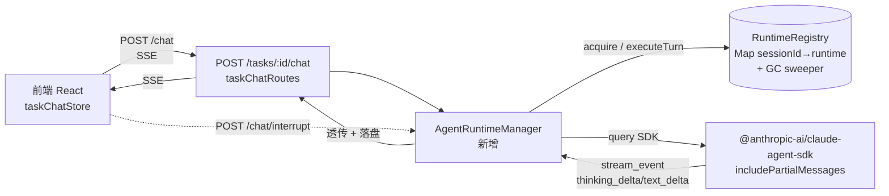

# 对话协同模式升级方案:常驻 Runtime 与流式体验

> **范围**:升级「A 模式 = 人机协同推进」(前端与 Claude 对话,一起推进任务)的**交互速度与体验**。
> **非范围**:不含「B 模式 = 自主派发」(multica 式后台自动跑完)。B 涉及 agent 编写 + 执行准确率,未调研,单独立项。
>
> **来源**:对照本地 `D:\Study\jetbrains-cc-gui`(IntelliJ 插件 + Node ai-bridge + React webview)、`multica`,以及 vibe-kanban / opencode / crush / claudia 等开源项目调研。前置讨论与文档断言排查见文末「相关文档」。

---

## 一、背景与目标

### 1.1 产品模式定位

项目经「会话化改造」(`docs/20260722172646_任务会话化改造设计方案.md`)后,任务从 TODO 直接被 Claude Code 经 MCP 拉取、或经对话通道(`POST /api/tasks/:id/chat`)spawn 处理。用户主力工作模式是 **A 模式:打开任务 → 在对话框与 Claude 协同推进**。

### 1.2 核心痛点(用户确认)

| 痛点 | 现象 | 根因 |
|---|---|---|
| 思考阶段空白 | Claude 思考时对话框一片空白,只一个计时器 | `claude -p` 默认 message 粒度输出,思考时不发增量;`AgentRunner` 也未开 partial |
| 每轮冷启动慢 | 每发一条消息都要重新 spawn Claude 进程 | 每轮新 `child_process.spawn`,无进程复用 |
| 缺控制能力 | 只能 kill 整个进程,不能中断单 turn / 切模型 / 看上下文占用 | 裸 spawn CLI,拿不到 SDK 控制接口 |
| 缺原生功能 | 无文件/截图上传、无通知、无斜杠命令、刷新丢窗口态 | 前端未实现 |

> **澄清**:**SSE 传输不是瓶颈**。A 模式下 SSE 单向 + 旁路 HTTP(stop)够用,WS 是「锦上添花」不是「必需」,本方案**缓做 WS**。

### 1.3 目标

让 A 模式**更快(消除冷启动)、更流畅(思考可见)、更可控(中断/切模型)、更原生(文件/通知/命令)**,体验对标 jetbrains-cc-gui。

---

## 二、现状诊断(代码事实)

### 2.1 当前对话链路

```
前端 taskChat.ts (fetch 读流)
  → POST /api/tasks/:id/chat  (taskChatRoutes.ts)
    → AgentRunner.run()  spawn claude (AgentRunner.ts)
      → claude stream-json 逐事件
    → SSE 透传  (taskChatRoutes.ts:126)
  → taskChatStore.applyEvent 渲染
```

### 2.2 关键现状(均为代码实证)

| 文件:行 | 现状 | 问题 |
|---|---|---|
| `AgentRunner.ts:84-91` | `baseArgs` 无 `--include-partial-messages` | 思考不发增量 |
| `AgentRunner.ts:89` | `--permission-mode bypassPermissions` | 所有操作自动放行,无审批交互 |
| `AgentRunner.ts:92` | 支持 `--resume <sid>` | 续接机制已有 ✅ |
| `AgentRunner.ts:45-49` | `shouldKeep` 过滤,只留 assistant/user/result/system-init | partial/thinking 事件被丢弃 |
| `AgentRunner.ts:123-127` | prompt 走 stdin envelope,纯 `text` content block | 不支持图片/文件多模态 |
| `AgentRunner.ts:118` | 每轮 `spawn(command, args, ...)` | **无进程复用,冷启动** |
| `taskChatRoutes.ts:3` | 注释明写「旁路通道:不写 tasks.json、不转状态机」 | 对话与任务状态割裂(属 008 范畴) |
| `taskChatRoutes.ts:126` | SSE `data: ...` 透传 | 单向,控制要另开 HTTP |
| `taskChatStore.ts:294-313` | usage 存内存 | 刷新即丢,未落库 |
| `TaskConversation.tsx:114` | 仅 `ThinkingIndicator` 计时器 | 思考空白,无内容 |

### 2.3 文档盲区

`docs/20260725030000_对话主功能上线后-项目提升计划.md` 讲了 dispatch 融合 / WS / usage / worktree GC / 错误分类,但**完全没提「常驻 runtime 管理」这层**——而这恰是优秀产品拉开体验差距的核心(见第三章)。本方案补这个盲区。

> 另:该文档部分现状断言不准确(dispatch 接口已随会话化改造移除、「文件轮询」实为按需拉、turns 持久化误述为待做),实施时以其**架构判断**为准、**现状措辞**需对照代码,勿照搬。

---

## 三、核心洞察:一条分水岭

**所有体验好的产品(vibe-kanban / opencode / crush / jetbrains-cc-gui)都用 Claude Agent SDK 的「常驻 runtime」,不是裸 spawn CLI。**

| 维度 | 裸 spawn CLI(本项目 / claudia) | Agent SDK 常驻 runtime(优秀产品) |
|---|---|---|
| 冷启动 | 每轮新进程 | 跨 turn 保活,秒级续接 |
| 思考可见 | 靠 `--include-partial-messages`(易漏) | `includePartialMessages` 原生 |
| 中途控制 | 只能 kill 整进程 | `query.interrupt()` 中断单 turn、会话不死 |
| 切模型/权限 | 要重启进程 | `setModel()` / `setPermissionMode()` 热切换 |
| 上下文占用 | 看不到 | `getContextUsage()` 实时 |
| 预热 | 无 | `preconnect` 首条零延迟 |

> **反面教材 claudia**:漏掉 partial flag + 每轮 respawn → Issue #71「spinner 转不出流」+ 冷启动慢。**本项目当前 `AgentRunner` 正走在这条路上。**
>
> **正面样本 jetbrains-cc-gui**:`ai-bridge/services/claude/persistent-query-service.js` + `runtime-registry.js` 给出了生产级实现,是本方案中期阶段的主要借鉴。

---

## 四、目标架构



**三层变化**:
1. **后端 runtime 层(新增)**:`AgentRuntimeManager` + `RuntimeRegistry`,常驻 SDK query,注册表 + GC + 预热。
2. **传输层(基本不动)**:SSE 保留;新增 `POST /chat/interrupt` 旁路 HTTP 做控制。
3. **前端层(增强)**:thinking 流式渲染 + 停止按钮调 interrupt + 补全 provider + AskUser 弹窗 + 通知。

---

## 五、分阶段实施计划

### Phase 1【P0 · 1-2 天】思考流式 + 续接(零架构改动,立刻见效)

在现有裸 spawn 上加 partial flag,先把「思考空白」这个最痛的点解决。

| 任务 | 改动 | 依赖 | 预估 |
|---|---|---|---|
| spawn 加 partial flag | `AgentRunner.ts:84` baseArgs 增 `--include-partial-messages` | 无 | 0.2d |
| 事件过滤放开 | `AgentRunner.ts:45` `shouldKeep` 保留 `stream_event` / `content_block_delta` | 上项 | 0.2d |
| shared 类型补 thinking_delta | `shared/types` 的 `AgentEvent` 加 `{type:'thinking_delta', text}` 等 | 上项 | 0.2d |
| 前端思考流式渲染 | `taskChatStore.applyEvent` 处理 thinking_delta;`ThinkingCard` 流式 | 上项 | 0.4d |
| 版本兜底 | 锁 Claude Code `>= 2.1.214`;partial 不可用时 fallback 整 message(等同现状) | — | 0.2d |

**验收**:Claude 思考过程实时逐字流出,不再空白;续接(`--resume`)行为不变。

> 注:Phase 1 不涉及任务上下文注入(008-step2 在做,不重复)。

### Phase 2【P1 · 1-2 周】常驻 runtime + 注册表(能力跃迁,解决冷启动)

`AgentRunner` 从裸 `child_process.spawn` 迁移到 `@anthropic-ai/claude-agent-sdk` 的 `query()`,抄一份 runtime-registry。

**核心接口设计(接口优先,实现后置)**:

```ts
// backend/src/application/agent/AgentRuntime.ts
interface AgentRuntime {
  sessionId: string | null;
  query: SDKQuery;              // SDK query 对象,含 interrupt/setModel/getContextUsage
  inputStream: AsyncQueue<SDKUserMessage>;  // 喂消息的队列
  createdAt: number;
  lastUsedAt: number;
  activeTurnCount: number;      // 正在跑的 turn 数,>0 不回收
  closed: boolean;
}

// backend/src/application/agent/AgentRuntimeManager.ts
interface AgentRuntimeManager {
  acquire(ctx: RuntimeContext): Promise<AgentRuntime>;     // 按 sessionId/signature 复用或新建
  executeTurn(rt: AgentRuntime, msg: SDKUserMessage, signal: AbortSignal): AsyncGenerator<AgentEvent>;
  interrupt(sessionId: string): Promise<void>;             // 中断当前 turn,会话保活
  dispose(rt: AgentRuntime): Promise<void>;
  preconnect(ctx: RuntimeContext): Promise<void>;          // 预热,首条零延迟
  cleanupStale(): Promise<void>;                           // GC,定时调
  getSnapshot(): { sessionCount: number; anonymousCount: number };
}
```

**生命周期常量(抄 jetbrains-cc-gui `runtime-registry.js:7-10`,按单机调小)**:

```ts
const RUNTIME_MAX_ABSOLUTE_LIFETIME_MS = 6 * 60 * 60 * 1000;  // 绝对寿命 6h
const SESSION_RUNTIME_MAX_IDLE_MS    = 30 * 60 * 1000;        // 会话空闲 30min 回收
const SESSION_CLEANUP_INTERVAL_MS    = 5 * 60 * 1000;         // 每 5min 后台清理,unref()
```

| 任务 | 改动 | 依赖 | 预估 |
|---|---|---|---|
| 引入 SDK | `backend` 装 `@anthropic-ai/claude-agent-sdk`;`utils/sdk-loader.ts` | 无 | 0.3d |
| RuntimeRegistry | 新增 `agent/RuntimeRegistry.ts`(Map + GC + 后台 sweeper + unref) | 上项 | 1d |
| AgentRuntimeManager | 新增 `agent/AgentRuntimeManager.ts`(acquire/executeTurn/interrupt/dispose/preconnect) | 上项 | 2d |
| 改造对话路由 | `taskChatRoutes.ts` POST /chat → `manager.acquire` + `executeTurn`;保留 SSE 透传 | 上项 | 1d |
| 中断接口 | 新增 `POST /tasks/:id/chat/interrupt` → `manager.interrupt` | 上项 | 0.3d |
| DI 注册 | `infrastructure/di/container.ts` `useFactory` 注册 manager(红线:必须 useFactory) | 上项 | 0.2d |
| 前端停止按钮 | `taskChatStore.stop` 调 `/chat/interrupt` 替代 abort kill | 上项 | 0.3d |
| 流式归一化 | 借鉴 `stream-event-processor` / `stream-delta-normalizer`,thinking/text/tool 增量归一 | 上项 | 1d |
| 日志 | runtime 生命周期(acquire/dispose/GC)写文件日志(项目红线) | 上项 | 0.3d |

**验收**:同一任务连发多条消息,首条后无冷启动;点「停止」单 turn 中断、会话不死、可继续;思考过程流式可见。

### Phase 3【P2 · 渐进叠加】产品功能(各独立,按需排)

每项独立、可见效果,可穿插在 Phase 1/2 之间或之后。

| 借鉴项 | 来源 | 价值 | 代价 | 优先级 |
|---|---|---|---|---|
| **补全 provider 架构** | jetbrains `providers/`(`slashCommandProvider`/`fileReferenceProvider`/`agentProvider`) | `/` `@` 命令系统,可扩展 | 中(前端) | P2 |
| **对话回退(rewind)** | jetbrains `message-rewind.js` | 试错可重来 | 中(前后端) | P2 |
| **AskUserQuestion 弹窗** | jetbrains `AskUserQuestionDialog` + 打通本项目 `AgentRunner.ts:171` 已收的 `control_request` | 「需要回应」通知(用户需求) | 低 | P2 |
| **会话自动标题** | jetbrains `session-title-service`(Haiku fire-and-forget) | 会话管理体验 | 低 | P2 |
| **文件/截图上传** | jetbrains `attachment-service` + 前端 `usePasteAndDrop` | 多模态给 Claude | 中(改 envelope/前端) | P2 |
| **MCP 健康检测** | jetbrains `mcp-status/` | MCP 静默失效排查(项目红线痛点) | 中 | P2 |
| **完成通知** | 浏览器 Notification API + 监听 result 事件 | 切走窗口也能知道跑完 | 低(前端) | P2 |
| **刷新保窗口** | 窗口存在性 + 当前 taskId + 抽屉态存 localStorage(位置已存) | 刷新不重置 | 低-中(前端) | P2 |

---

## 六、风险与权衡

| 风险 | 应对 |
|---|---|
| SDK 0.x 版本 API 易变 | 锁 patch 版本;接口收敛在 `AgentRuntimeManager`,隔离 SDK 变更 |
| `includePartialMessages` 老版本 Claude Code 不可用 | 锁 `>= 2.1.214`;不可用时 fallback 整 message(等同 Phase 0 现状) |
| `--resume` 偶发 "conversation not found" | 失败 fallback 新 session + 前端提示 |
| **WSL ↔ Windows 混合**(项目红线) | SDK runtime 进程跑在 **Windows 主侧**(node_modules 安装侧);cwd/settings 走 `resolveDataDir()` 统一入口,不散用 `os.homedir()` |
| runtime 崩溃丢会话 | claude 自身 jsonl 是真相源,刷新可经 `ClaudeSessionScanner.loadTimeline` 恢复;manager 启动时不重建,按需 acquire |
| **WS 升级** | 缓做。单机 SSE + `/chat/interrupt` 旁路已覆盖 A 模式;WS 留到需要「后台常驻 + 多端观看」(即 B 模式)时再上 |

---

## 七、与 B 模式(自主派发)的关系

常驻 runtime 是 **A / B 共同的基础设施**,本方案投入不白做:
- **A 模式**(本方案)用它 = 协同更快(秒级续接、可中断、思考可见)。
- **B 模式**(未来,搁置)将来也是在这套 runtime 上加「自动多轮 + 任务回写」。

B 模式的真实难点(本方案不涉及):agent 编写(让 Claude 自主且正确执行)、执行准确率(可控性/成本/验收),需单独立项调研。

---

## 八、相关文档

- `docs/20260725030000_对话主功能上线后-项目提升计划.md` — 提升路线图(本方案补其「常驻 runtime」盲区;现状措辞需对照代码)
- `docs/20260725020000_Claude实时任务对话_实现报告.md` — 当前 spawn 对话实现
- `docs/20260722172646_任务会话化改造设计方案.md` — 会话化改造(dispatch 移除背景)
- `docs/20260723130001_项目避坑与约定.md` — 环境与红线

---

## 九、参考

**本地项目**
- `D:\Study\jetbrains-cc-gui\ai-bridge\services\claude\persistent-query-service.js` — 常驻 runtime 主逻辑
- `D:\Study\jetbrains-cc-gui\ai-bridge\services\claude\runtime-registry.js` — 注册表 + GC(生命周期常量见 :7-10)
- `D:\Study\jetbrains-cc-gui\ai-bridge\services\claude\stream-event-processor.js` — 流式事件归一化
- `D:\Study\multica\server\` — daemon / WS / pkg/agent(多副本生产级,按需参考)

**开源项目**
- BloopAI/vibe-kanban — 最相似(Rust + 看板 + streaming)
- sst/opencode — Vercel AI SDK streamText
- charmbracelet/crush — workspace + SSE session
- winfunc/opcode(前 claudia)— 反面教材(漏 partial flag、每轮 respawn)

**官方文档**
- Agent SDK streaming-output — `includePartialMessages` / `StreamEvent`
- Agent SDK streaming-vs-single-mode — Streaming Input Mode + image content block
- Agent SDK typescript — `query()` / `interrupt()` / `startup()` / `getContextUsage()`
- Messages API streaming — `thinking_delta` / `signature_delta` envelope
- Headless CLI — `--include-partial-messages` / `--verbose` / `--resume`
- Sessions — `~/.claude/projects/<hash>/<sid>.jsonl` 持久化
