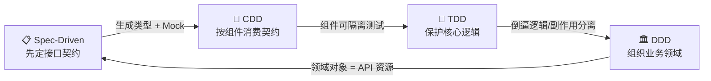

# MOC: 开发方法论(全栈闭环四件套)

本 MOC 聚合**面向 AI 时代全栈开发**的四种核心方法论。它们不是孤立的教条,而是一套可闭环的工作流:从定义接口契约、构建组件、保护核心逻辑,到组织业务领域,四个维度共同构成「边界清晰、文档明确、AI 编码助手读得懂」的高效开发流。

> 选型依据:精力有限,不追求学遍所有「X-Driven」。这四者覆盖了前端、后端、AI 逻辑三个层面,是投入产出比最高的组合。

---

## 🚀 闭环总览

**一次完整迭代的节奏**:

| 步骤 | 用谁 | 产出 |
|------|------|------|
| ① 想清楚页面模块 + API 协议 | **CDD + Spec-Driven** | 组件树 + openapi 契约 |
| ② 后端分层,业务逻辑与持久化分离 | **DDD 简化版** | 四层架构 + 充血模型 |
| ③ 啃难写的纯逻辑前先写测试 | **TDD 简化版** | 单测保护的核心函数 |
| ④ 让 AI 重构 / Agent 调接口 | **Spec + CDD 边界** | spec 转 tool,组件可局部手术 |

---

## 📂 四篇原子笔记

> 每篇独立可检索,以下为一句话定位。详细内容点链接。

- [[20260709221000_规格驱动设计]] —— 先写 OpenAPI 契约,前端类型/Mock/AI 工具描述全部自动生成。**AI 时代的绝对核心**:OpenAPI → tool schema → LLM function calling。
- [[20260709221100_组件驱动开发CDD]] —— 先造原子组件再拼页面。现代写法 = shadcn/ui + 自定义 hook,**别再用过时的「容器/展示组件」二分法**。
- [[20260709221200_测试驱动开发TDD]] —— Red-Green-Refactor。**简化版**:只对复杂算法/解析/状态机/AI 调度这类难写对的逻辑用,Vitest + Mock。
- [[20260709221300_领域驱动设计DDD]] —— 把业务逻辑从框架代码剥离。**简化版**:分层架构 + 充血模型 + 值对象三件套,告别「大泥球」路由。

---

## 🎯 每篇的核心一句话

| 方法论 | 核心动作 | 关键避坑 |
|--------|---------|---------|
| **Spec-Driven** | 契约先行,机器推导一切 | OpenAPI 3.1 可空字段用 `["string","null"]`,别用 `nullable` |
| **CDD** | 自底向上,原子组合 | 容器/展示组件已被作者收回,改用自定义 hook |
| **TDD** | 先红后绿,小步重构 | 只测有逻辑的核心,别给 getter 凑覆盖率 |
| **DDD** | 领域藏最里,依赖向内 | 领域层零框架依赖,贫血模型是反模式 |

---

## 🔗 四者如何互相成就

- **Spec ↔ CDD**:spec 定义数据形状,CDD 定义如何把数据渲染成可复用组件。前端用 `openapi-typescript` 拿到类型,直接喂给组件 Props。
- **Spec ↔ TDD**:spec 生成的 Mock 数据,是 TDD 红绿循环的燃料;契约测试本身就是 TDD 在接口层的延伸。
- **CDD ↔ TDD**:组件隔离(单一职责)→ 可脱离路由单独测试,与 TDD 天然契合。
- **TDD ↔ DDD**:TDD 倒逼「纯逻辑从副作用剥离」,正好实现 DDD「领域层纯净、可独立测试」的目标。
- **DDD ↔ Spec**:DDD 的聚合根和用例,是 spec 里「资源和操作」的来源——领域建模先于接口定义。

---

## 📌 决策记录

1. **只学四件套,不求全**(2026-07-01):精力有限,Spec/CDD/TDD/DDD 覆盖前端+后端+AI 三层,是 ROI 最高的组合,不追 BDD/Clean Architecture/Hexagonal 等其他「X-Driven」。
2. **全部走「简化版」**(2026-07-09):TDD 只测核心逻辑、DDD 只用战术三件套、不追求 100% 覆盖或微服务拆分。遵循 KISS & YAGNI。
3. **以 AI 协作为第一性原理**(2026-07-09):四者共同价值是「边界清晰 + 文档明确」,让 Claude Code 这类 AI 助手读得懂、改得准——这是选型的隐形主线。
4. **本项目(ai-task-flow)是 DDD 落地样板**(2026-07-09):`domain/workflow` 聚合根、四层架构、值对象,可直接作为 DDD 篇的真实案例。

---

## 🧭 落地建议(给全栈进阶者)

1. **先吃透 DDD 战术版 + TDD 简化版**(后端地基):这两者直接决定代码可维护性,且本就有现成样板(本项目)。
2. **再上 Spec-Driven**(协作与 AI):当项目出现「前端等后端」「字段对不上」「想让 Agent 调接口」时,立刻为正收益。
3. **CDD 持续修炼**(前端日常):保持 `components/ui/` 原子层 + 业务组件 + 自定义 hook 的习惯即可,不必强上 Storybook。

---

**相关 MOC**:
- [[MOC_知识库建设]] —— 本知识库的组织方法论(PARA / MOC / 原子笔记),与本篇同源
- [[MOC_AI图片生成]] —— 另一个主题聚合页

**标签**: #开发方法论 #全栈 #Spec-Driven #CDD #TDD #DDD #AI-Agent

**创建日期**: 2026-07-09
**维护规则**: 新增/修订任一篇方法论后,更新本 MOC 的「核心一句话」与「互相成就」两节
