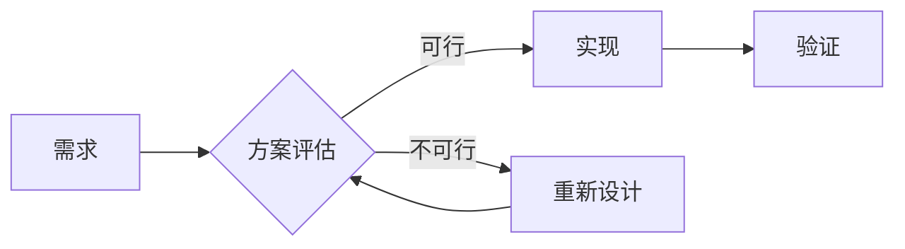

# 示例:方案讨论记录模板

这是一篇示例文档,演示 Markdown 的各种渲染效果。你可以删掉它,换成自己和 AI 讨论的真实方案。

## 背景

记录一下讨论这个方案的起因和要解决的问题。

## 方案对比

| 方案 | 优点 | 缺点 | 结论 |
|------|------|------|------|
| 方案 A | 简单直接 | 扩展性差 | ❌ |
| 方案 B | 灵活 | 复杂度高 | ✅ 采用 |
| 方案 C | 性能好 | 成本高 | 备选 |

## 关键代码

```javascript
// 示例:防抖函数
function debounce(fn, delay) {
  let timer = null;
  return function (...args) {
    clearTimeout(timer);
    timer = setTimeout(() => fn.apply(this, args), delay);
  };
}
```

```python
# 示例:类型注解
def greet(name: str) -> str:
    return f"Hello, {name}!"
```

## 流程图(Mermaid)



## 引用与提示

> 💡 这是一段引用,可以用来强调 AI 给出的关键结论或注意事项。

## 待办清单

- [x] 完成方案调研
- [x] 搭建知识库框架
- [ ] 补充更多文档

---

*最后更新:记得每次讨论后更新这里。*
