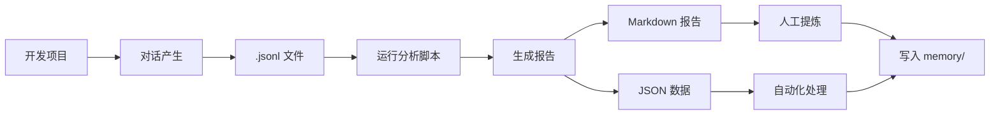

# Claude 对话历史分析方案 - 实施总结

> 生成时间：2026-07-01
> 项目：KnowledgeBase

---

## ✅ 核心结论

**Claude Code 完全可以读取并分析自己的对话历史**

### 存储位置

```
C:\Users\<用户名>\.claude\projects\<项目路径>\<会话ID>.jsonl
```

### 文件格式

- **JSONL**（每行一个 JSON 对象）
- 包含完整对话记录：用户消息、AI 回复、工具调用、执行结果
- 支持解析时间戳、消息关联（通过 UUID）

---

## 🛠️ 已实现工具

### 1. `analyze-conversation-v2.ps1`

**功能**：
- 解析 JSONL 对话文件
- 提取用户问题、助手回复、工具使用统计
- 生成 Markdown 报告 + JSON 数据

**使用方法**：
```powershell
.\scripts\analyze-conversation-v2.ps1 `
  -SessionFile "C:\Users\fjyu9\.claude\projects\xxx\<会话ID>.jsonl" `
  -ProjectName "项目名称" `
  -OutputDir "docs/项目复盘"
```

**输出**：
- `<时间戳>_<项目名>_对话分析.md` - 可读性强的分析报告
- `<时间戳>_<项目名>_对话数据.json` - 结构化数据，可用于二次开发

---

## 🌐 业界方案验证

通过网络搜索发现多个类似项目，证明方案可行性：

1. **[ChatLab](https://github.com/hellodigua/ChatLab)** - 本地聊天记录分析工具（AI Agent 驱动）
2. **[WayLog](https://github.com/shayne-snap/WayLog)** - AI 对话导出为 git 友好知识库
3. **[Simon Willison 的 claude-code-transcripts](https://github.com/simonw/claude-code-transcripts)** - 专门处理 Claude Code 对话记录
4. **[Inside Claude Code: Session File Format](https://databunny.medium.com/inside-claude-code-the-session-file-format-and-how-to-inspect-it-b9998e66d56b)** - 会话文件格式深度解析

---

## 📊 实测效果

### 当前会话分析结果

| 指标 | 数量 |
|------|------|
| 用户消息 | 3 条 |
| 助手回复 | 18 条 |
| 对话轮次 | 3 轮 |
| 生成报告大小 | ~5KB（优化后） |

**关键提取内容**：
1. 用户需求："从对话历史中提取项目开发经验"
2. 技术方案：探测存储位置 → 解析 JSONL → 生成报告
3. 工具实现：PowerShell 脚本 + JSON 解析

---

## 🎯 应用场景

### 1. 项目复盘
开发结束后，一键提取所有技术讨论和决策记录

### 2. 知识沉淀
将对话中的经验教训自动归档到 memory 系统

### 3. 跨项目学习
聚合多个项目的相关主题（如"性能优化"、"错误处理"）

### 4. 团队分享
生成可读性强的 Markdown 报告，便于团队学习

---

## 🔄 工作流程



---

## 📌 下一步优化方向

### 1. 增强智能提取
- [ ] 使用 Claude API 对对话内容做语义分析
- [ ] 自动识别"问题-解决方案"对
- [ ] 提取代码片段并分类

### 2. 与记忆系统集成
- [ ] 自动写入 `memory/debugging.md`
- [ ] 生成 `memory/decisions/*.md`
- [ ] 更新 `MEMORY.md` 索引

### 3. 批量处理
- [ ] 扫描所有历史项目
- [ ] 按主题聚合（前端、后端、数据库等）
- [ ] 生成知识图谱

### 4. 可视化
- [ ] 对话时间线图
- [ ] 工具使用热力图
- [ ] 问题类型分布饼图

---

## 💡 关键经验

1. **JSONL 解析注意点**：
   - `message.content` 可能是字符串或数组（包含 text/tool_use 块）
   - 需过滤工具调用结果，只提取真实对话
   - 大文件需分段读取（>256KB 时）

2. **PowerShell 最佳实践**：
   - 使用 `ConvertFrom-Json` 解析
   - 用 `Write-Progress` 提示进度
   - 输出同时生成 Markdown + JSON

3. **文档组织**：
   - 按时间戳命名，便于追溯
   - 放在 `docs/项目复盘/` 独立目录
   - 遵循 CLAUDE.md 的文档管理规范

---

## 📚 参考资源

- [Claude Code 文档 - Session Storage](https://code.claude.com/docs/en/sessions)
- [Medium 文章 - Inside Claude Code Session Format](https://databunny.medium.com/inside-claude-code-the-session-file-format-and-how-to-inspect-it-b9998e66d56b)
- [GitHub - ChatLab](https://github.com/hellodigua/ChatLab)
- [GitHub - WayLog](https://github.com/shayne-snap/WayLog)
- [GitHub - claude-code-transcripts](https://github.com/simonw/claude-code-transcripts)

---

## 🔖 标签

`对话分析` `知识管理` `经验提取` `JSONL` `PowerShell` `自动化`
