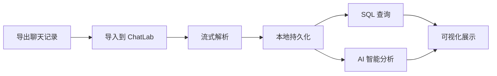
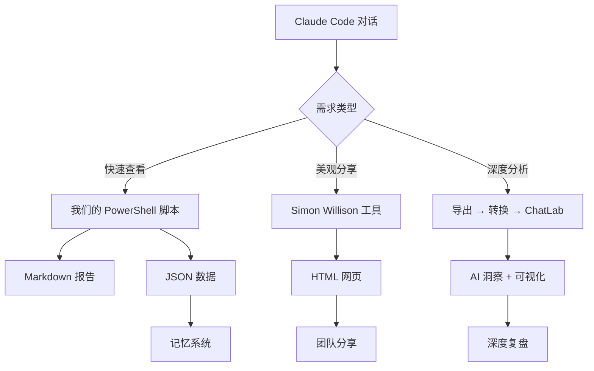

# ChatLab vs 我们的 PowerShell 脚本 - 深度对比

---

## 🎯 ChatLab 是什么？

**定位**：本地化的智能聊天记录分析平台（桌面应用 + Web UI）

**核心理念**：
> 用 AI Agent 深度分析你的社交聊天历史，挖掘对话模式和洞察

---

## 📦 ChatLab 的使用方式

### 安装

**方式 1：桌面应用（推荐）**
```
1. 访问 chatlab.fun 或 GitHub Releases
2. 下载安装包（Windows/Mac/Linux）
3. 双击安装，启动即用
```

**方式 2：命令行（开发者）**
```bash
# 安装（需要 Node.js ≥ 20）
npm i chatlab-cli -g

# 启动（自动打开浏览器）
chatlab start

# 后台运行
chatlab start --daemon
```

### 使用流程



**5 步工作流程**：
1. **导出** - 从 WhatsApp/QQ/Discord 等平台导出聊天记录
2. **导入** - 拖拽文件到 ChatLab
3. **解析** - 流式处理（支持百万级消息）
4. **分析** - SQL 查询 + AI Agent（24+ 工具）
5. **可视化** - 趋势图、互动频率、排名等

---

## 🤖 ChatLab 的 AI 分析能力

### 核心：AI Agent + 24+ 工具

**功能示例**：
- 📊 "分析我和 Alice 的对话频率变化趋势"
- 🔍 "找出去年 12 月讨论最多的话题"
- 💬 "总结我在群聊中最常提到的关键词"
- 📈 "统计我每天发消息的时间分布"
- 🎯 "提取与工作相关的所有对话"

**技术实现**：
- **Function Calling** - AI 自动选择合适工具
- **SQL 引擎** - 灵活的结构化查询
- **语义搜索** - 理解自然语言问题
- **上下文感知** - 记住对话上下文

---

## 🎨 ChatLab 的界面

**Web UI 特性**：
- 📱 响应式设计（桌面 + 移动端）
- 📊 数据可视化仪表板
- 🔍 实时搜索和过滤
- 💬 AI 对话式查询界面
- 📈 图表和统计报表

**支持的可视化**：
- 时间趋势图
- 互动热力图
- 消息类型分布
- 活跃时段分析
- 词云和关键词

---

## 📊 ChatLab vs 我们的脚本 - 详细对比

| 维度 | ChatLab | 我们的 PowerShell 脚本 |
|------|---------|---------------------|
| **定位** | 通用聊天记录分析平台 | 专门针对 Claude Code 对话 |
| **界面** | ⭐⭐⭐⭐⭐ 精美 Web UI + 桌面应用 | ❌ 纯命令行 |
| **AI 能力** | ⭐⭐⭐⭐⭐ 24+ 工具 + Agent | ❌ 无 AI 分析 |
| **可视化** | ⭐⭐⭐⭐⭐ 图表、趋势、热力图 | ❌ 纯文本输出 |
| **交互方式** | 自然语言对话式查询 | 命令行参数 |
| **数据规模** | ⭐⭐⭐⭐⭐ 百万级消息流式处理 | ⭐⭐ 单会话处理 |
| **支持平台** | WhatsApp/QQ/Discord 等 8+ | 仅 Claude Code |
| **安装** | 需 Node.js 或下载安装包 | ✅ Windows 原生 |
| **响应速度** | ⭐⭐⭐ 复杂查询需等待 | ⭐⭐⭐⭐⭐ 秒级输出 |
| **学习成本** | ⭐⭐⭐ 需熟悉界面和功能 | ⭐⭐⭐⭐⭐ 一条命令 |
| **离线使用** | ✅ 完全本地运行 | ✅ 完全本地运行 |
| **隐私保护** | ⭐⭐⭐⭐⭐ 数据不出本地 | ⭐⭐⭐⭐⭐ 数据不出本地 |
| **可编程性** | ⭐⭐ 有 API 但复杂 | ⭐⭐⭐⭐⭐ JSON 输出易集成 |

---

## 🎯 ChatLab 的核心优势

### 1. **智能分析能力** ⭐⭐⭐⭐⭐
```
用户："分析我和 Bob 今年的对话频率变化"
ChatLab AI：
1. 查询你和 Bob 的所有消息
2. 按月分组统计
3. 生成趋势图
4. 发现关键事件（如 3 月对话突然增多）
```

### 2. **可视化洞察** ⭐⭐⭐⭐⭐
- 📊 互动热力图（哪些时段最活跃）
- 📈 消息趋势线（对话频率变化）
- 🏆 好友排行榜（互动最多的人）
- ☁️ 关键词云（讨论最多的话题）

### 3. **跨平台统一** ⭐⭐⭐⭐
```
支持 8+ 平台的聊天记录：
WhatsApp, QQ, Discord, Telegram, iMessage...
统一格式，统一分析
```

### 4. **大规模处理** ⭐⭐⭐⭐⭐
```
流式解析 + 多进程：
✅ 百万级消息秒级加载
✅ 实时搜索响应
✅ 不卡顿、不崩溃
```

---

## ⚠️ ChatLab 的局限

### 1. **通用 ≠ 专用**
- ❌ 不是专门为 Claude Code 设计
- ❌ 需要手动导出、导入
- ❌ 可能无法识别 Claude Code 的特殊格式

### 2. **重量级**
- ❌ 需要安装 Node.js 或下载几百 MB 安装包
- ❌ 启动需要时间（数据库初始化）
- ❌ 占用内存较多

### 3. **复杂度**
- ❌ 功能多，学习曲线陡
- ❌ AI 查询需要等待（调用 LLM）
- ❌ 不适合快速一次性查询

---

## 🚀 我们脚本的优势

### 1. **专用性** ⭐⭐⭐⭐⭐
```powershell
# 一条命令，直接读取 Claude Code 对话
.\analyze-conversation-v2.ps1 -SessionFile "xxx.jsonl" -ProjectName "MyProject"
```
- ✅ 无需导出导入
- ✅ 直接读取 .jsonl 文件
- ✅ 理解 Claude Code 的消息结构

### 2. **轻量级** ⭐⭐⭐⭐⭐
- ✅ 无额外依赖（Windows 原生）
- ✅ 秒级启动
- ✅ 几十 KB 脚本文件

### 3. **可编程** ⭐⭐⭐⭐⭐
```powershell
# 输出 JSON，易于自动化处理
$data = Get-Content "xxx_对话数据.json" | ConvertFrom-Json
$data.UserMessages | Where-Object { $_.Content -like "*bug*" }
```

### 4. **简单直接** ⭐⭐⭐⭐⭐
- ✅ 一条命令搞定
- ✅ 文本输出，易读易用
- ✅ 无需学习复杂界面

---

## 🎯 使用场景对比

### 选 ChatLab 如果你：
1. ✅ 需要分析**社交聊天记录**（微信、QQ、Discord 等）
2. ✅ 想要**深度 AI 分析**和洞察挖掘
3. ✅ 需要**可视化图表**展示趋势
4. ✅ 处理**大量历史消息**（几十万、上百万条）
5. ✅ 愿意花时间学习和配置

### 选我们的脚本如果你：
1. ✅ 只分析 **Claude Code 对话**
2. ✅ 需要**快速提取**关键信息
3. ✅ 要**自动化处理**（JSON 数据）
4. ✅ 希望**轻量级**，无额外依赖
5. ✅ 与**记忆系统**（memory/）集成

---

## 💡 能否用 ChatLab 分析 Claude Code 对话？

**理论可行，但不推荐**：

```
步骤：
1. 手动导出 .jsonl 文件
2. 转换为 ChatLab 支持的格式
3. 导入 ChatLab
4. 使用 AI 查询

问题：
❌ 格式不匹配，需要转换
❌ 大材小用（ChatLab 功能过于强大）
❌ 性能开销大（启动数据库、AI 推理）
```

**更好的方案**：
```
1. 用我们的脚本快速提取 → Markdown + JSON
2. 简单查询直接看 Markdown
3. 复杂分析用 JSON 编程
4. 需要分享用 Simon Willison 工具生成 HTML
```

---

## 🔄 三方案组合使用



---

## 📌 总结

### ChatLab 的核心价值
> **智能分析 + 可视化 + 跨平台**  
> 适合：社交聊天记录的深度挖掘

### 我们脚本的核心价值
> **轻量 + 快速 + 专用 + 可编程**  
> 适合：Claude Code 对话的快速提取和自动化

### 关键区别
| | ChatLab | 我们的脚本 |
|---|---------|-----------|
| **类型** | 重量级分析平台 | 轻量级提取工具 |
| **目标** | 深度洞察 | 快速提取 |
| **场景** | 通用聊天分析 | Claude Code 专用 |
| **复杂度** | ⭐⭐⭐⭐ | ⭐ |

**建议**：ChatLab 是强大的通用工具，但对于 Claude Code 对话分析，我们的专用脚本更合适！

---

## 📚 参考资源

- **ChatLab 官网**：https://chatlab.fun
- **GitHub**：https://github.com/hellodigua/ChatLab
- **文档**：提供快速开始指南和平台导出教程
