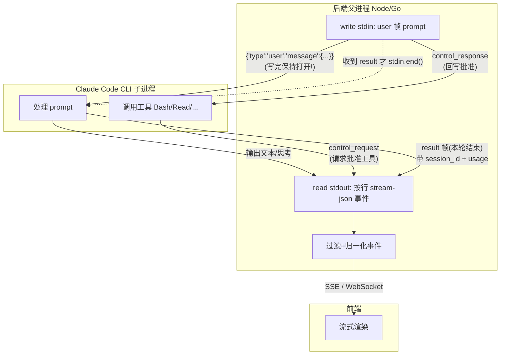
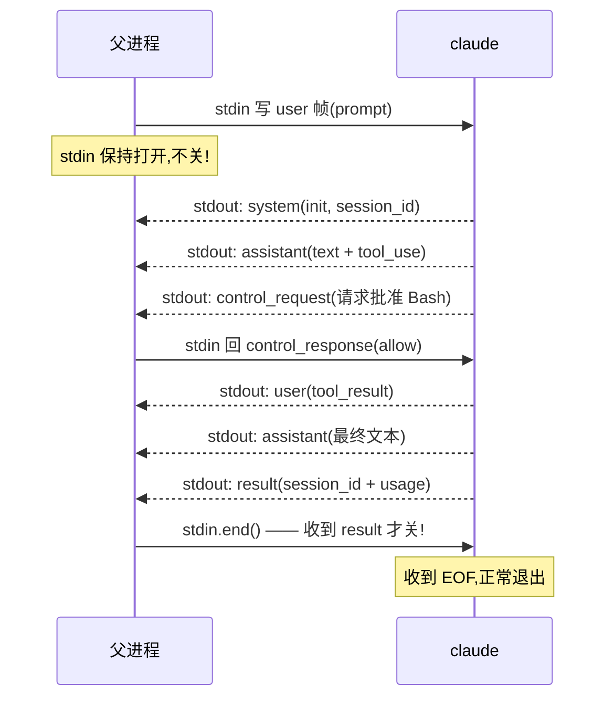
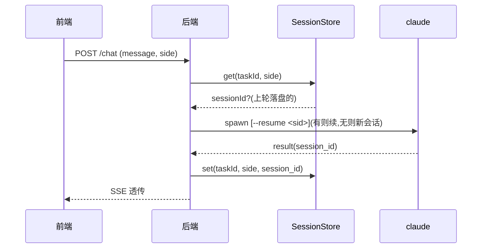

# 后端 spawn Claude CLI 通用方案(Windows + WSL)· 详解

> **这份文档能让你做到**:在自己的后端(Node/Go/Python 任意语言)里,从零拉起 Claude Code CLI(headless 模式),跟它双向通信,把回复流式回传给前端,并支持 Windows 与 WSL 两侧。照着做到底能跑通,不必重新踩坑。
>
> 蒸馏自 ai-task-flow「任务实时对话」功能的落地经验(含三天 WSL 排障全过程)+ multica(`D:\study\multica`,Go daemon)源码剖析。本项目具体实现细节见 `docs/20260725020000_Claude实时任务对话_实现报告.md`。

---

## 一、为什么需要这份方案(问题背景)

「让后端程序驱动 Claude 干活」有三种姿势,先选对路线:

| 姿势 | 谁起 claude | 交互方式 | 适用场景 | 代价 |
|---|---|---|---|---|
| **MCP 拉模型** | 用户在终端起 | claude 通过 MCP 工具反查后端 | 保留原生终端体验 | 后端被动,无实时流/自动化 |
| **SDK 嵌入** | 后端进程内 | 直接调 Anthropic API | 完全可控、轻量 | 失去 claude 的工具生态(Bash/Read/Edit/MCP) |
| **spawn CLI** ✅ 本方案 | 后端起子进程 | stream-json 双向流 | 网页原生、实时流、多 CLI、自动化编排 | 要处理进程/协议/隔离 |

**本方案 = spawn CLI**。选它的核心理由:**claude 的所有能力(内置工具、MCP、worktree、skills)都还在**,只是把它从「用户终端」搬到「后端子进程」。multica、Cursor、Cline 都走这条。

它解锁的能力(后端 spawn 是底座):
- 网页里实时对话(流式渲染文本/思考/工具调用)
- autopilot 自动连续派发
- 多 CLI 并存(claude/codex/gemini 切换)
- 统一的用量追踪、错误重试、并发控制

---

## 二、整体架构(一张图看懂数据怎么流)



**关键读懂这张图**:
1. prompt **不是**命令行参数,而是写到 claude 的 **stdin**(一个 JSON 帧)。
2. stdin 是**双向**的:不仅写 prompt,还要回写 `control_response`(claude 用工具前会先请示)。
3. claude 的输出(stdout)是**一行一个 JSON 事件**,父进程按行读、解析、过滤、转发前端。
4. `result` 帧标志本轮结束(带 token 用量和 session_id),收到它才关 stdin。

违反第 1、2 条任一点,最典型故障就是 **claude 静默 exit 0 无输出**(见第五节)。

---

## 三、spawn 命令逐项拆解(每个参数为什么)

完整命令:

```bash
claude -p \
  --output-format stream-json \
  --input-format stream-json \
  --verbose \
  --permission-mode bypassPermissions \
  --max-turns 50 \
  --settings /tmp/clean-settings.json \
  [--resume <session-id>]
```

| 参数 | 作用 | 为什么必需 | 能否省 |
|---|---|---|---|
| `-p` | print/headless 模式(非交互 TUI) | 后端无终端,不能进 TUI | ❌ 必需 |
| `--output-format stream-json` | stdout 输出**一行一个 JSON 事件** | 才能逐事件解析、流式转发 | ❌ 必需(否则是纯文本,丢失结构) |
| `--input-format stream-json` | stdin 按 stream-json 帧读 | prompt 经 stdin 写入的协议 | ❌ 必需(配合 stdin 写 prompt) |
| `--verbose` | 输出完整事件(含 system init 等) | 要拿 session_id/model/工具列表 | 建议保留 |
| `--permission-mode bypassPermissions` | 自动放行所有工具调用 | headless 无 UI 弹权限框 | ❌ 必需(否则卡在权限请求) |
| `--max-turns N` | 限制最大轮次(防失控) | claude 可能死循环烧 token | ❌ 必需(安全阀) |
| `--settings <file>` | 指定配置文件(隔离用户级 hook) | 省 token(见第八节) | 建议保留 |
| `--resume <sid>` | 续接历史会话 | 多轮对话连续 | 可选(首轮不传) |

> ⚠️ **stream-json 输入模式下 prompt 不在命令行**。`-p` 本身可接 prompt(`claude -p "hi"` 合法),但搭配 `--input-format stream-json` 时 prompt 必须走 stdin、命令行不传。见第五节。

---

## 四、stream-json 协议详解(每种事件怎么处理)

claude 在 stdout 一次输出一行 JSON,每行一个事件。完整事件清单:

### 4.1 `system`(subtype=init)— 启动初始化

```json
{"type":"system","subtype":"init","session_id":"a83a9c9a-...",
 "tools":["Bash","Read","Edit",...],"model":"glm-5.2",
 "permissionMode":"bypassPermissions","cwd":"/mnt/d/..."}
```

- **何时发**:claude 启动后第一条。
- **怎么处理**:可透传前端(展示 model);**记下 `session_id`**(用于续接)。

### 4.2 `assistant` — 模型输出

```json
{"type":"assistant","message":{"role":"assistant","content":[
  {"type":"text","text":"我先看看文件"},
  {"type":"thinking","thinking":"用户要..."},
  {"type":"tool_use","id":"toolu_01","name":"Read","input":{"file_path":"..."}}
]}}
```

- **何时发**:模型每段输出(文本/思考/工具调用)。
- **怎么处理**:把 `content[]` 归一化为 blocks:`text` / `thinking` / `tool_use`。`tool_use` 的 `id` 要留着,后面 `tool_result` 要按它回填。

### 4.3 `user` — 工具执行结果(tool_result)

```json
{"type":"user","message":{"content":[
  {"type":"tool_result","tool_use_id":"toolu_01","content":"文件内容...","is_error":false}
]}}
```

- **何时发**:claude 自己执行完工具后,把结果喂回给自己(父进程能旁听到)。
- **怎么处理**:按 `tool_use_id` 把结果**回填**到对应的 `tool_use` block(UI 上工具卡片显示结果)。

### 4.4 `result` — 本轮结束(最重要的收尾信号)

```json
{"type":"result","subtype":"success","session_id":"a83a9c9a-...",
 "usage":{"input_tokens":1234,"output_tokens":567,"total_cost_usd":0.01},
 "duration_ms":8200,"num_turns":3}
```

- **何时发**:本轮对话彻底结束。
- **怎么处理**:
  1. **落盘 `session_id`**(下轮 `--resume` 用);
  2. 记 `usage`(用量面板);
  3. **`stdin.end()`**(告诉 claude 没有更多输入,让它退出)。

### 4.5 `control_request` — 工具权限请示(⚠️ 易踩坑)

```json
{"type":"control_request","request_id":"req_01","tool":"Bash","input":{"command":"rm -rf ..."}}
```

- **何时发**:claude 想用某个工具前(即使 bypassPermissions 下,MCP 工具等仍可能发)。
- **怎么处理**:**必须回 `control_response`**,否则 claude 一直等 → 挂到 timeout(10 分钟)。
- **正解**(对齐 multica `claude.go` `handleControlRequest`):自动 approve,回**三层嵌套**结构(⚠️ 字段必须嵌在 `response.response` 里,放顶层会被 claude 忽略 → 仍挂 timeout):
  ```json
  {"type":"control_response","response":{
    "subtype":"success","request_id":"req_01",
    "response":{"behavior":"allow","updatedInput":{}}}}
  ```
- **最低限度**:至少 `warn` 留痕,知道为什么「转圈到 timeout」。

### 4.6 其他(`log` / `hook_*` / `thinking_tokens` / ...)

- **何时发**:内部日志、hook 触发、思考 token 计数。
- **怎么处理**:**过滤掉**(噪音,不透传前端)。

> 归一化算法详见项目实现报告第五节,有完整代码。

---

## 五、stdin:双向流(最容易踩坑,重点详解)

### 5.1 为什么 stdin 是「双向」的

直觉上 stdin 是「父→子」单向。但 `--input-format stream-json` 模式下,stdin 是一根**持续双向通道**:

- 父进程写 `user` 帧(prompt);
- claude 处理中可能从 stdout 发 `control_request`(请示工具权限);
- **父进程必须从同一根 stdin 回 `control_response`**;
- 直到父进程主动 `stdin.end()`(EOF),claude 才认为「没有更多输入」并最终退出。

### 5.2 完整一轮时序



### 5.3 三种「喂 prompt」方案对比(核心决策表)

| 方案 | 机制 | EOF 时机 | 结果 | 为什么 |
|---|---|---|---|---|
| **stdin pipe(写完保持打开)** ✅ | 父进程 `child.stdin.write(帧)`,不关 | 父进程主动 `end()`(收到 result 后) | ✅ 正常双向通信 | claude 随时可收 control_response |
| `< file` 重定向 ❌ | `claude ... < prompt.json` | **文件读完立即 EOF** | ❌ **静默 exit 0,无输出** | claude 误判「会话结束」,且无法回 control_response |
| 命令行 argv ❌ | `claude -p "<长文本>"` | N/A | ❌ 转义地狱、长度限制、泄露进程列表 | prompt 有引号/特殊字符就崩 |

### 5.4 「静默 exit 0 无输出」现象与诊断

这是违反 stdin 规则后**最常见、最坑**的故障:

| 现象 | 说明 |
|---|---|
| claude 启动后立刻 exit 0 | 退出码是 0(看似成功) |
| stdout 完全空白 | 连 `system(init)` 都没有 |
| stderr 也空 | 没有任何错误线索 |
| **间歇性成功** | 碰巧那一轮 claude 没发 control_request,EOF 前已处理完 |

**诊断方法**:
1. 确认有没有用 `< file`(几乎必是它);
2. 改成 stdin pipe 写入 + 保持打开;
3. 加 `console.log` 确认 envelope 真的写进了 stdin(给子进程启动时间再写)。

> 本项目 WSL 侧踩了这个坑三天,详见项目实现报告第四节。

---

## 六、Windows 侧完整实现(Node)

```ts
import { spawn } from 'node:child_process';
import { createInterface } from 'node:readline';

// 1. 构造参数(协议级固定值,见第三节)
const args = [
  '-p',
  '--output-format', 'stream-json',
  '--input-format', 'stream-json',
  '--verbose',
  '--permission-mode', 'bypassPermissions',
  '--max-turns', String(maxTurns),
  '--settings', cleanSettingsPath,   // 隔离用户 hook,见第八节
];
if (resumeSessionId) args.push('--resume', resumeSessionId);

// 2. spawn
//    - shell:true:Windows 上 claude 是 claude.cmd shim,需要 shell 解释
//    - stdio 全 pipe:stdin 要写、stdout 要读、stderr 要兜底报错
const child = spawn(
  process.env.CLAUDE_EXECUTABLE?.trim() || 'claude',
  args,
  { cwd: workDir, shell: true, stdio: ['pipe', 'pipe', 'pipe'] },
);

// 3. prompt 经 stdin 写入 stream-json user 帧
//    结构固定:type=user + message.role=user + content[](text block)
const envelope = JSON.stringify({
  type: 'user',
  message: { role: 'user', content: [{ type: 'text', text: prompt }] },
}) + '\n';   // ⚠️ 末尾换行:stream-json 按行读,缺换行 claude 可能不处理
child.stdin.write(envelope);
// ⚠️ 写完不关!保持打开等 control_request / 写 control_response

// 4. 按行读 stdout
const rl = createInterface({ input: child.stdout });
for await (const line of rl) {
  if (!line.trim()) continue;
  const ev = JSON.parse(line);
  // 过滤噪音,只留对话事件(system/assistant/user/result),见第四节
  if (isNoise(ev)) continue;
  forwardToFrontend(ev);   // SSE/WS 透传
  if (ev.type === 'result') {
    saveSessionId(ev.session_id);   // 落盘续接
    child.stdin.end();              // ✅ 收到 result 才关 stdin
    break;
  }
}
```

---

## 七、WSL 侧完整实现(从 Windows 后端调 WSL 内的 claude)

### 7.1 什么时候需要

用户主力在 WSL(home、claude 配置、历史会话都在 WSL 侧),后端跑 Windows 时要驱动 WSL 里的 claude。**不能**简单 `spawn('claude')`(那是 Windows 的 claude,不同环境)。

### 7.2 wsl.exe 的硬事实(每条都实测过)

| 事实 | 实测 | 结论 |
|---|---|---|
| **转发 stdin pipe** | `wsl.exe -- bash cat.sh`(脚本内 `cat`),Node 写进 wsl.exe stdin 两行,cat **完整回显** | wsl.exe 把父进程 stdin 接到 WSL 内进程 stdin。**早期误判「不转发」是测试没给子进程启动时间** |
| `--` 后参数是逐个 argv | `wsl.exe -- claude --max-turns 50` → claude 收到正确 argv | 每个 token 独立传递 |
| **但带空格的值会拆坏** | `wsl.exe -- bash -c "claude -p"` → bash 的 `-c` 只拿到 `claude`,后续丢了 | wsl.exe 把 `--` 后参数**用空格拼成命令行**,引号丢失。**解法:不走 `bash -c`,直接 `-- claude <独立参数>`** |
| `--cd` 必须在 `--` 前 | `wsl.exe --cd /mnt/d/... -- claude` | `--cd` 是 wsl.exe 选项,`--` 后是给子进程的 |
| 路径用 `/mnt/c/...` | `wslpath 'C:\Users\x'` → `/mnt/c/Users/x` | Windows 路径要翻译 |

### 7.3 正解代码

```ts
if (side === 'wsl') {
  return spawn(
    'wsl.exe',
    [
      '--cd', toWslPath(workDir),           // 在 -- 前
      '--',                                  // 之后全是给 claude 的 argv
      'claude',                              // WSL PATH 里的 claude(/usr/bin/claude)
      ...args,                               // 同 Windows 的协议参数
      '--settings', toWslPath(cleanSettingsPath),  // 路径翻译
    ],
    { shell: false, stdio: ['pipe', 'pipe', 'pipe'] },  // ← 同样 stdin pipe!
  );
}
// 后续 stdin.write / 按行读 stdout / result 才 end —— 与 Windows 侧完全一致
```

**WSL 与 Windows 的唯一差异**:`command`、`cwd`/`settings` 路径翻译、`shell:false`。**stdio / stdin / 事件处理完全统一**。

### 7.4 ❌ 走过的弯路(每条都试过,别再试)

| 尝试 | 现象 | 为什么不行 |
|---|---|---|
| `bash -c "claude ..."` 脚本 | bash 启动但 claude 参数丢失 | wsl.exe `--` 后空格拼接,`-c` 引号失效 |
| `claude ... < prompt.json` 文件重定向 | **claude 静默 exit 0,无输出** | 文件读完 EOF,stream-json 期望持续流(第五节) |
| WSLENV 桥接数据目录 | 从 Windows Terminal 启的 WSL 拿不到变量 | WT 用进程级 WSLENV 覆盖注册表(见 [WSL↔Windows 通用方案](./20260724095424_WSL与Windows环境变量桥接通用方案.md)) |

---

## 八、隔离用户级配置(--settings clean.json)

### 8.1 为什么要隔离

claude 启动会加载用户级 `~/.claude/settings.json`(hooks、permissions、MCP、skills)。其中 **SessionStart hook**(如 superpowers 插件)会在对话开始时往上下文注入大量内容。

**实测影响**:同一个 prompt,不隔离时单轮 `input_tokens` ≈ **35k**,隔离后 ≈ **2.5k**——**14 倍**。重度使用下成本和延迟都不可接受。

### 8.2 解法

写一个干净 settings 临时文件,`--settings` 指向它:

```ts
const CLEAN_SETTINGS = JSON.stringify({
  hooks: {},                              // 清空所有 hook,阻断 SessionStart 注入
  permissions: { allow: [], deny: [], ask: [] },
});
// 写到 os.tmpdir()/xxx-clean-settings.json,模块级缓存复用(内容不变)
```

### 8.3 trade-off(要知道的局限)

`--settings` 是**合并而非替换**:能清 hooks/permissions,但**清不掉**用户级 MCP servers 和 skills(它们由别的机制加载)。所以 WSL 侧 claude 带的 MCP(如 zai-mcp)和 skills 仍会加载,token 仍可能偏高。属可接受折中。

---

## 九、会话续接(--resume + 按侧存储)

### 9.1 续接流程



首轮没 sessionId → claude 新建会话 → `result` 带回 `session_id` → 落盘。下一轮带上 `--resume` → 续接同一会话(有完整上下文)。

### 9.2 按侧存储(关键)

Windows claude 和 WSL claude 是**两套独立环境**(不同 home),session 池互不相通。

| 存储 key | 值 |
|---|---|
| `taskId → { windows?: sid, wsl?: sid }` | **按侧独立** |

**为什么必须按侧**:拿 Windows 的 sessionId 去 `--resume` WSL claude,会报 `No conversation found with session ID`,对话直接失败。

> 旧格式(扁平 `taskId → sid` 字符串)加载时归一为 `{windows: sid}`(向后兼容,旧数据全是 Windows 侧的)。

---

## 十、错误处理与进程清理(健壮性详解)

### 10.1 场景与处理

| 场景 | 现象 | 处理 |
|---|---|---|
| claude 没装 / WSL 没起 | exit code 非 0(127 等) | **把 stderr 末尾拼进 error message**(否则前端只看到 exit code,分不清原因) |
| 用户点「停止」/ 客户端断开 | — | `AbortController` → `child.kill('SIGTERM')` |
| 超时 | claude 卡死 | 定时器 SIGTERM |
| **WSL 孤儿进程** | kill 了 wsl.exe,但 WSL 内 claude 还在跑 | finally **先 destroy stdio**(见 10.2)再 kill |
| SSE 流已 end 还写 | `ERR_STREAM_WRITE_AFTER_END` | 写前 `if (!reply.writableEnded)` 卫语句 |
| sessionId 路径穿越 | URL 传 `../../etc/passwd` 拼路径 | 校验 `/^[A-Za-z0-9-]+$/`(claude sid 是 UUID) |

### 10.2 重点:WSL 孤儿进程

`kill(wsl.exe)` 只杀 wsl.exe 进程,**不保证连带杀掉 WSL 内的 claude**(不同 PID 命名空间)。结果:claude 继续跑到 max-turns/timeout,占用资源、可能继续写文件。

**解法**:finally 里**先 `destroy` 三个 stdio 流**,再 kill。destroy stdin → claude 收到 EOF → 自行退出(因为 stdin 关了它知道没更多输入)。这是比单纯 kill 更可靠的清理方式。

```ts
} finally {
  clearTimeout(timer);
  // 先断 stdio(WSL 下 kill wsl.exe 不杀 claude,断 stdin 让 claude 自退),再 kill 兜底
  try { child.stdin?.destroy(); child.stdout?.destroy(); child.stderr?.destroy(); } catch {}
  if (!child.killed && child.exitCode === null) child.kill();
}
```

---

## 十一、多 CLI 扩展(适配器模式,借鉴 multica)

要支持多个 AI CLI(claude/codex/gemini…),定义统一接口,每 CLI 一个实现:

```ts
interface AgentBackend {
  spawn(opts: RunOptions): ChildProcess;
  // 各 CLI 的事件流协议不同,各自实现解析
}
// ClaudeBackend / CodexBackend / GeminiBackend ... 各一个文件
// 工厂:agentFactory(type) → 对应 backend
```

**新增一个 CLI = 加一个文件,零侵入核心**。multica 的 `server/pkg/agent/` 正是如此:`claude.go`/`codex.go`/`qwen.go`/… 各实现 `Backend` 接口,`agent.New(type)` 工厂分发(见第十四节)。

---

## 十二、决策一览表(每行配解释)

| 决策 | 选 | 不选 | 为什么 |
|---|---|---|---|
| prompt 传递 | **stdin pipe** | 命令行 / `< file` | 命令行转义崩、file 重定向 EOF 静默退出 |
| stdin 生命周期 | **收到 result 才 end** | 写完即关 | stream-json 是持续双向流,早关丢 control_response |
| WSL 调用 | **`wsl.exe -- claude` + pipe** | `bash -c` / WSLENV / file | argv 不被拆、stdin 可转发、不依赖被覆盖的环境变量 |
| 权限模式 | **bypassPermissions** | 交互式 | headless 无 UI,没法弹权限框 |
| hook 隔离 | **--settings clean.json** | 继承用户级 | 省 token(35k→2.5k,14 倍) |
| session 存储 | **按侧 {windows, wsl}** | 单一 sid | 两套 claude 不同 home,跨侧 resume 报错 |
| 进程清理 | **destroy stdio + kill** | 只 kill | 防 WSL 孤儿进程 |
| 日志 | **FileLogger 落文件** | console | 事后排查(注意 stdin/prompt 不入日志) |
| 多 CLI | **适配器模式** | if-else 分支 | 扩展性,借鉴 multica |

---

## 十三、避坑清单(每条:现象 / 根因 / 解法)

| # | 现象 | 根因 | 解法 |
|---|---|---|---|
| 1 | WSL 侧 claude 静默 exit 0,无任何输出 | 用了 `< file` 重定向,文件读完 EOF | 改 stdin pipe,见第五节 |
| 2 | 误判「wsl.exe 不转发 stdin」 | 测试时没给子进程启动时间就写 stdin | 测试加 `setTimeout` 再写,或用 `cat` 验证 |
| 3 | `bash -c "claude..."` 在 wsl.exe 下参数丢失 | wsl.exe `--` 后参数空格拼接,`-c` 引号失效 | 直接 `-- claude <独立参数>`,不走 bash -c |
| 4 | resume 报 `No conversation found` | 拿了另一侧的 sessionId | 按侧存取 `{windows, wsl}` |
| 5 | 单轮 input token 暴涨到几万 | 用户级 SessionStart hook 注入 | `--settings clean.json` 清 hooks |
| 6 | 用户点「停止」后 claude 还在跑 | 只 abort 了 HTTP,没 kill 子进程 | AbortController → child.kill,且 finally destroy stdio |
| 7 | 错误只显示 `exit code=127`,分不清原因 | error message 没带 stderr | message 拼 stderr 末尾 300 字 |
| 8 | sessionId 拼路径被穿越 | URL param 直接拼 `${sid}.jsonl` | 正则校验 `/^[A-Za-z0-9-]+$/` |
| 9 | 对话「转圈」到 10 分钟 timeout | claude 发了 control_request 没人回 | 回 **三层嵌套** control_response(见 §4.5),auto-approve;扁平结构会被忽略 |
| 10 | 历史会话面板交互差 | 自写浮层(无点外关闭/键盘) | 用 radix Popover 等 UI 库原语 |

---

## 十四、multica 关键源码点(回溯核实)

`D:\study\multica\server\pkg\agent\claude.go` 是工业级参考(行号随 multica 版本漂移,以函数名为准):

| 设计 | 函数 | 要点 |
|---|---|---|
| prompt 经 stdin pipe | `buildClaudeInput`/`writeClaudeInput` (claude.go:668) | 写 stream-json user 帧 |
| stdin 保持打开 | Execute 内 (claude.go:78-128) | 写完首帧不关,收 result 才 closeStdin |
| 协议级参数保护 | `claudeBlockedArgs` (claude.go:594) | 黑名单锁死 `-p`/`--output-format` 等,用户 custom_args 不可覆盖 |
| control_request 自动批准 | `handleControlRequest` (claude.go:380) | 回 `behavior:"allow"`,强制 run_in_background=false |
| resume 拒绝检测 | `resumeWasRejected` (claude.go:699) | 匹配 `no conversation found`,丢 sid 重试 |
| 多 CLI 适配器 | `pkg/agent/*.go` + `agent.New` (agent.go:284) | 每 CLI 一文件,工厂分发 |
| Windows 进程窗口 | `proc_windows.go` | `CREATE_NEW_CONSOLE + HideWindow`(非 NO_WINDOW,否则孙子弹窗风暴) |
| 进程清理 | `cmd.WaitDelay = 10s` | 强制 reap |

> multica **不做 WSL 分支**(宿主机一侧直接 spawn 本机 claude)。WSL 侧是本项目因用户主力在 WSL 额外实现的。

---

## 十五、可复刻检查清单(照着做到底能跑通)

- [ ] spawn 命令带齐:`-p` + `--output-format stream-json` + `--input-format stream-json` + `--verbose` + `--permission-mode bypassPermissions` + `--max-turns`
- [ ] prompt 经 **stdin pipe** 写入 stream-json user 帧(末尾带 `\n`),**写完不关**
- [ ] stdout 用 readline **按行读**,每行 `JSON.parse`
- [ ] 过滤噪音,只处理 `system/assistant/user/result`
- [ ] 收到 `result` 才 `stdin.end()` + 落盘 `session_id`
- [ ] WSL 侧:`wsl.exe --cd <mnt> -- claude <args>` + **同样 stdin pipe**(不用 file、不用 bash -c)
- [ ] `--settings` 指向清空 hooks 的干净配置文件
- [ ] sessionId **按侧**存储
- [ ] finally **destroy stdio + kill**(防 WSL 孤儿)
- [ ] error message 拼 stderr;sessionId 校验正则
- [ ] 中断:AbortController → kill;超时:定时器 kill
- [ ] (进阶)control_request → control_response auto-approve

> 全部勾选 = 一套可稳定支撑日常使用的对话链路。

## 十六、参考

- 本项目实现报告:`docs/20260725020000_Claude实时任务对话_实现报告.md`
- [WSL↔Windows 跨 home 数据目录通用方案](./20260724095424_WSL与Windows环境变量桥接通用方案.md)
- multica 源码:`D:\study\multica\server\pkg\agent\claude.go`
