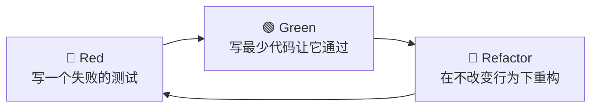

# 测试驱动开发 (Test-Driven Development, TDD) —— 简化版

> 更新时间:2026-07-09
> 关联技术:Vitest · Jest · vi.mock
> 适用场景:复杂算法、数据解析、AI ReAct 调度/Prompt 拼接等易错核心逻辑

---

## 一句话定位

**先写一个会失败的测试,再写让它通过的最少代码,最后重构。** 用测试定义「什么叫完成」,让代码从第一行起就被保护。

> 💡 本篇强调**简化版 TDD**:不追求 100% 覆盖率、不强制每行都先测。只在「难写对、易回归」的核心逻辑上用,其余地方写常规测试即可。

---

## 二、为什么要用(哪怕只用简化版)

### 反馈环从分钟级压到毫秒级

写复杂逻辑时,如果每次验证都要「启动整个 Next.js → 登录 → 点按钮 → 看控制台」,一轮反馈要几十秒甚至几分钟。先写一个单元测试,反馈压到**几十毫秒**,而且每次保存自动跑。

### 测试是「可执行的需求文档」

好的测试名就是一句需求:`should_returnBlocked_when_taskHasUnmetDependency`。半年后回来看,测试比注释更可靠地告诉你这函数该干什么。

### 防回归

改 A 不小心弄坏 B,测试立刻红。AI 编码时代尤其重要——你让 AI 重构,测试红就是护栏。

### 倒逼好设计

「这个函数难测」往往意味着它耦合太重、依赖太多外部状态。TDD 会逼你把纯逻辑从副作用(网络/数据库)里剥离出来——这恰好是 DDD 想要的分层。

---

## 三、Red-Green-Refactor 循环

Kent Beck 在 1990 年代末创立 TDD(代表作《Test-Driven Development: By Example》),核心是三个步骤反复循环,Martin Fowler 将其总结为 **Red-Green-Refactor**:



| 阶段 | 做什么 | 关键纪律 |
|------|--------|----------|
| 🔴 **Red** | 写一个描述期望行为的测试,**确认它真的失败**(且因正确原因失败) | 没看到红,就不知道测试有效 |
| 🟢 **Green** | 写**最少**的代码让测试通过——哪怕先写死返回值 | 目标是「通过」,不是「完美」 |
| 🔵 **Refactor** | 测试全绿的前提下,清理重复、命名、结构 | **每一步重构后测试必须仍绿** |

> 🎯 核心心法:**小步快走**。一个循环只解决一小块行为,循环越短,越不容易卡死。

---

## 四、「简化版」的边界:测什么,不测什么

| ✅ 值得 TDD(难写对、易回归) | ❌ 不值得 TDD(测了也白测) |
|-------------------------------|----------------------------|
| 复杂算法(排序、调度、分页) | 纯 CRUD 的 getter/setter |
| 数据解析(解析 AI 返回的结构化 JSON) | 框架胶水代码(路由配置) |
| 状态机转换(任务状态流转) | 第三方库的直接调用(测的是别人代码) |
| 边界条件密集(金额计算、日期) | UI 视觉样式(交给视觉回归/E2E) |
| ReAct 调度逻辑、Prompt 拼接 | 一次性脚本 |

> 本项目(ai-task-flow)的 `Task` 聚合根状态机、`JsonChatRepository` 的解析、`GlmWebSearchClient` 的三重 JSON 解包——都是 TDD 的理想对象;而 Fastify 路由的注册胶水则不需要。

---

## 五、工具:Vitest(2026 现代全栈首选)

| 对比项 | Vitest | Jest |
|--------|--------|------|
| 与 Vite 集成 | **原生**(Next.js/Vite 项目零配置) | 需额外配置 babel/swc |
| 启动速度 | 极快(复用 Vite 转译管线) | 较慢 |
| API | **几乎与 Jest 兼容**(`describe/it/expect`) | 行业标准 |
| ESM/TS 支持 | 原生 | 需配置 |
| Watch 模式 | 智能 HMR,秒级反馈 | 标准 watch |

> 迁移成本:`jest` → `vitest` 基本是改 import + 配置,API 几乎一致。本项目 backend 已用 Vitest。

---

## 六、Mock:测纯逻辑,不测外部依赖

TDD 的纪律之一是**只测被测对象,Mock 掉外部依赖**(网络、数据库、文件系统),否则你的测试又慢又脆。

```ts
import { describe, it, expect, vi } from "vitest";
import { parseAiToolCall } from "./parseAiToolCall";

describe("parseAiToolCall", () => {
  // ✅ 测的是「解析逻辑」,不真的调大模型
  it("should_extractToolName_when_modelReturnsValidJson", () => {
    const raw = '{"name":"search","arguments":{"q":"React 19"}}';
    const result = parseAiToolCall(raw);
    expect(result.name).toBe("search");
    expect(result.arguments).toEqual({ q: "React 19" });
  });

  // ✅ 边界:模型偶尔返回带 markdown 代码块包裹的 JSON
  it("should_stripCodeFence_when_jsonWrappedInBackticks", () => {
    const raw = '```json\n{"name":"search","arguments":{}}\n```';
    const result = parseAiToolCall(raw);
    expect(result.name).toBe("search");
  });

  // ✅ 异常:畸形输入抛错且带上下文
  it("should_throwWithContext_when_inputIsNotJson", () => {
    expect(() => parseAiToolCall("not a json")).toThrow(/解析失败/);
  });
});
```

### Mock 网络请求

```ts
import { vi } from "vitest";

// 把外部依赖整个替换成假实现
vi.mock("./llmClient", () => ({
  callLlm: vi.fn().mockResolvedValue('{"name":"search","arguments":{}}'),
}));
```

> 纪律对照(见 CLAUDE.md):**Mock 外部依赖(数据库/HTTP/MQ),不 Mock 被测对象自身的方法**。

---

## 七、一个完整的小循环(从红到绿)

假设要写一个「解析 AI 返回的工具调用 JSON」的函数,模型有时会用 ```json 代码块包起来,有时直接给裸 JSON。

**① Red——先写测试(此时函数还不存在,导入就报错):**

```ts
it("should_parse_when_wrappedInCodeFence", () => {
  expect(parseAiToolCall('```json\n{"name":"x"}\n```')).toEqual({ name: "x" });
});
it("should_parse_when_plainJson", () => {
  expect(parseAiToolCall('{"name":"x"}')).toEqual({ name: "x" });
});
// 运行 → 🔴 红(函数不存在/不处理 fence)
```

**② Green——写最少代码让它过:**

```ts
export function parseAiToolCall(raw: string) {
  const cleaned = raw.replace(/```(?:json)?/g, "").trim();
  return JSON.parse(cleaned);
}
// 运行 → 🟢 绿
```

**③ Refactor——测试保护下优化(抽取 fence 剥离逻辑、加错误上下文):**

```ts
const CODE_FENCE = /```(?:json)?/g;

function stripCodeFence(raw: string): string {
  return raw.replace(CODE_FENCE, "").trim();
}

export function parseAiToolCall(raw: string) {
  try {
    return JSON.parse(stripCodeFence(raw));
  } catch (e) {
    throw new Error(`AI 工具调用解析失败: ${raw.slice(0, 80)}`);
  }
}
// 运行 → 仍 🟢 绿,代码却更干净了
```

---

## 八、常见误区

| ❌ 反例 | ✅ 正解 |
|--------|--------|
| 一个 test case 塞多个不相关断言 | 一个测试只验证一个行为(CLAUDE.md 明确规定) |
| 测试名写成 `test1`/`test2` | 用 `should_X_when_Y` 语义命名 |
| 测试依赖执行顺序或共享可变状态 | 每个测试自建数据,互不影响 |
| Mock 了被测对象自身的方法 | 只 Mock 外部依赖,DB/HTTP 才 Mock |
| 为了凑覆盖率给 getter 写测试 | 只测有逻辑的代码,胶水代码免测 |
| 跳过 Red 直接写 Green | 先确认测试真的会失败,否则测试可能永远「假绿」 |
| 重构时关掉测试 | 重构的前提就是测试全绿,关了就失去保护 |

---

## 九、什么时候别 TDD

- **探索性原型**:还在试错,接口天天变,先写测试纯属浪费(YAGNI)
- **纯 UI 调整**:布局/颜色改动,靠眼睛看,交给 E2E 或视觉回归
- **一次性脚本**:跑完就丢
- **极其简单的透传函数**:`return a + b` 这种,测试比实现还长

> 简化版口诀:**「这块逻辑我有没有把握一次写对?」没有 → TDD;有 → 写完补几个回归测试即可。**

---

## 十、速查清单

- [ ] 难写对的核心逻辑才上 TDD,胶水代码免测
- [ ] 严格 Red → Green → Refactor,先看到红
- [ ] 一个测试一个行为,命名 `should_X_when_Y`
- [ ] Mock 外部依赖(DB/HTTP),不 Mock 被测对象
- [ ] Vitest 首选(Jest 兼容 API,Vite 原生)
- [ ] 重构期测试必须全程保持绿色
- [ ] 探索期/纯 UI/一次性脚本:别 TDD

---

## 十一、参考资料

- [Test Driven Development — Martin Fowler](https://martinfowler.com/bliki/TestDrivenDevelopment.html)
- [Test-driven development — Wikipedia(Kent Beck 创立)](https://en.wikipedia.org/wiki/Test-driven_development)
- [What is test-driven development (TDD)? — Tricentis](https://www.tricentis.com/learn/test-driven-development)
- [Vitest 官方文档](https://vitest.dev/guide/)
- [Writing Tests Before the Implementation — jhumelsine](https://jhumelsine.github.io/2024/07/15/tdd.html)

---

**相关方法论**(全栈闭环四件套):
- 👉 [[20260709221000_规格驱动设计]] —— spec 生成的 Mock 是 TDD 红绿循环的燃料
- 👉 [[20260709221100_组件驱动开发CDD]] —— 组件隔离 = 可单独测试,TDD 的前提
- 👉 [[20260709221300_领域驱动设计DDD]] —— TDD 倒逼「纯逻辑从副作用剥离」,正好实现 DDD 分层

> 归档位置:`技术方案/架构设计/` · 索引见 [[MOC_开发方法论]]
