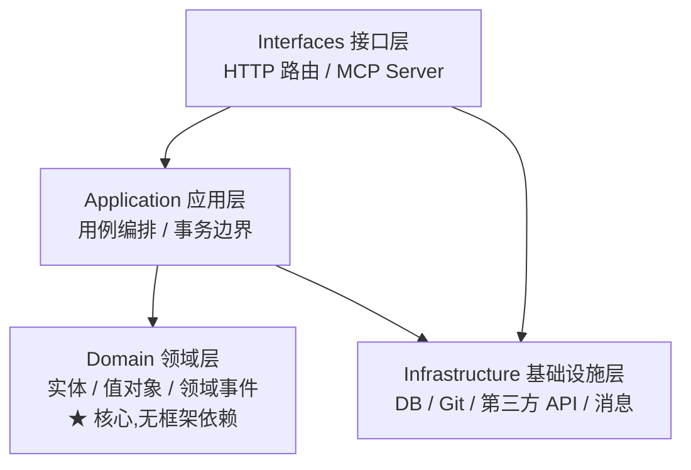

# 领域驱动设计 (Domain-Driven Design, DDD) —— 简化战术版

> 更新时间:2026-07-09
> 原典:Eric Evans《Domain-Driven Design》(2003,「蓝皮书」)
> 关联技术:TypeScript · 分层架构 · 聚合根 · 领域事件
> 适用场景:业务复杂、易腐化的全栈项目

---

## 一句话定位

**把「业务逻辑」从「框架代码」里剥离出来,让核心领域模型自己拥有行为。** DDD 的战术思想教你建模(实体/值对象/聚合),战略思想教你划边界(限界上下文),让业务规则集中、可测、不腐烂。

> 💡 本篇是**简化战术版**:不读 Evans 那本厚书、不搞微服务和事件溯源,只吸收「分层 + 战术建模 + 充血模型」这三把刀,足够拯救 80% 的「大泥球」后端。

---

## 二、为什么需要:拯救「大泥球」

传统全栈开发的典型腐烂路径——所有逻辑堆在 API 路由层(Next.js 的 `app/api/.../route.ts`、Express 的 controller):

```ts
// ❌ 大泥球:一个路由文件干了所有事
app.post("/api/orders/:id/cancel", async (req, res) => {
  const order = await db.order.findById(req.params.id);   // 取数
  if (order.status !== "pending") return res.status(400); // 业务规则
  if (Date.now() - order.createdAt > 24 * 3600 * 1000)    // 业务规则
    return res.status(400);
  const refund = await paymentApi.refund(order.amount);   // 第三方调用
  await db.order.update(req.params.id, { status: "cancelled" }); // 持久化
  await mailer.send(order.userId, "已取消");               // 副作用
  res.json({ ok: true });
});
```

问题:路由文件几百行、业务规则散落各处、无法测试、改一处牵一片、AI 读不懂边界。

DDD 的解法:**「订单能不能取消」是订单自己的事,不该写在路由里。**

---

## 三、两大维度:战略 vs 战术

| 维度 | 回答的问题 | 产出 | 何时重点用 |
|------|-----------|------|-----------|
| **战略设计 (Strategic)** | 这个系统有哪些领域?边界在哪? | 限界上下文、上下文映射、统一语言 | 多团队/微服务/大系统 |
| **战术设计 (Tactical)** | 一个领域内部怎么建模? | 实体、值对象、聚合、仓储 | **全栈项目日常(本篇重点)** |

> 简化版建议:**先吃透战术设计**,战略设计等系统大到需要拆微服务再深入。

---

## 四、战略设计(快速过一遍)

### 1. 统一语言 (Ubiquitous Language)

开发者和领域专家**用同一套词汇**,且这套词汇直接出现在代码里。如果业务方叫「派发任务」,代码里就别叫 `executeJob`——叫 `dispatchTask`。语言不一致 = 翻译损耗 = bug 温床。

### 2. 限界上下文 (Bounded Context)

一个领域模型只在**特定边界内**有效。「订单」在销售上下文里是「含商品明细的交易」,在物流上下文里是「一个待发货包裹」——别强求一个万能 `Order` 类,各自建模。

### 3. 子域划分 (Subdomain)

- **核心子域 (Core)**:业务的护城河,自己写、重投入(如任务调度引擎)
- **支撑子域 (Supporting)**:必要但非差异化,可自写或采购
- **通用子域 (Generic)**:成熟通用(如鉴权、通知),直接买/用开源

> 本项目(ai-task-flow)选 DDD 四层的核心理由就是「未来要扩展多个 Bounded Context」——workflow / research / llm-config / vocab 已经是四个 context 的雏形。

---

## 五、战术构建块(本篇灵魂)

| 构建块 | 定义 | 例子 |
|--------|------|------|
| **实体 (Entity)** | 靠**身份标识(id)**区分,有生命周期,属性可变 | `Task`(有 id,状态会变) |
| **值对象 (Value Object)** | 靠**属性值**区分,**不可变**,无身份 | `Money`(100, CNY)、`TaskStatus` |
| **聚合 (Aggregate)** | 一组相关实体+值对象的集群,保证内部一致性 | `Task` 聚合(含步骤、结果) |
| **聚合根 (Aggregate Root)** | 聚合的**唯一入口实体**,外部只能通过它操作聚合 | `Task` 本身 |
| **仓储 (Repository)** | 像集合一样存取聚合,屏蔽持久化细节 | `TaskRepository.findById()` |
| **领域事件 (Domain Event)** | 领域里发生的重要事实,用于解耦通知 | `TaskDispatched` |
| **领域服务 (Domain Service)** | 不属于任何单一实体的业务逻辑 | `PricingService`(跨多个实体计价) |
| **工厂 (Factory)** | 封装复杂对象的创建 | `Task.create()` |

### 聚合根是「一致性边界」

> 核心规则:**一次事务只修改一个聚合,且只能通过它的聚合根。** 外部代码不能绕过 `Task` 直接改它内部的步骤——必须调 `Task` 暴露的方法。

### 代码对照(本项目真实结构)

```
backend/src/domain/workflow/
├── entities/
│   └── Task.ts                    # 聚合根 + 实体(充血模型)
├── value-objects/
│   ├── TaskId.ts                  # 值对象:任务标识
│   ├── TaskStatus.ts             # 值对象:状态机
│   ├── Priority.ts               # 值对象:优先级
│   └── WorktreeRef.ts            # 值对象:worktree 引用
├── events/
│   ├── TaskDispatched.ts         # 领域事件
│   ├── TaskApproved.ts
│   └── TaskRejected.ts
└── repositories/
    └── TaskRepository.ts          # 仓储接口(抽象)
```

---

## 六、充血模型 vs 贫血模型(用户重点)

这是 DDD 战术落地最关键的抉择。

| 类型 | 贫血模型 (Anemic) | 充血模型 (Rich) |
|------|-------------------|-----------------|
| 数据对象 | 只有字段 + getter/setter | 字段 **+ 行为方法** |
| 业务逻辑在哪 | 散落在 Service / 路由里 | **在对象自己身上** |
| 可测试性 | 差(逻辑和副作用纠缠) | 好(纯领域对象,脱离框架测) |
| DDD 立场 | ❌ Martin Fowler 称之为「反模式」 | ✅ DDD 推崇 |

### 对比代码

```ts
// ❌ 贫血模型:Task 只是数据袋,规则在 Service
class Task {
  status: string;
  createdAt: Date;
}
class TaskService {
  canCancel(task: Task): boolean {
    return task.status === "pending" && /* 规则 */ true;
  }
}

// ✅ 充血模型:Task 自己知道「能不能取消」
class Task {
  constructor(
    private status: TaskStatus,
    private createdAt: Date,
  ) {}
  canCancel(): boolean {           // 行为内聚在实体上
    return this.status.equals(TaskStatus.PENDING)
      && this.isWithin24h();
  }
  private isWithin24h(): boolean { /* 内部规则 */ }
}

// 路由变得极薄,只做参数校验 + 调用
app.post("/orders/:id/cancel", (req, res) => {
  const order = repo.find(req.params.id);
  if (!order.canCancel()) return res.status(400); // 规则问 order 自己
  order.cancel();                                  // 行为也在 order 上
  repo.save(order);
  res.json({ ok: true });
});
```

> 对照本项目:`domain/workflow/entities/Task.ts` 的 `dispatch()` / `approve()` / `reject()` / `recordResult()` 就是充血模型——状态转换规则内聚在聚合根上,而不是散在路由或 Service。这正是 TDD 最容易测的部分。

---

## 七、分层架构:把领域藏在最里面

DDD 经典四层,依赖方向**永远向内**(外层依赖内层,内层不依赖外层):



| 层 | 职责 | 禁止 |
|----|------|------|
| **Interfaces 接口层** | 接收请求(HTTP/MCP)、参数校验、结果包装 | 写业务逻辑 |
| **Application 应用层** | 编排用例、事务边界、调用领域对象 | 实现领域规则 |
| **Domain 领域层** | 实体、值对象、领域事件——**业务规则的家** | 依赖任何框架(DB/HTTP) |
| **Infrastructure 基础设施层** | 仓储实现、外部 API、消息、文件 | 含业务规则 |

> **黄金法则:领域层必须是纯的**——它不 import fastify、不 import prisma、不知道数据存哪。这样领域逻辑可以脱离框架单独测试(配合 TDD)。

### 本项目分层映射

```
backend/src/
├── domain/          # 领域层(workflow/research/llm-config/vocab)
├── application/     # 应用层(用例编排,如 ChatService、LlmConfigService)
├── infrastructure/  # 基础设施(JsonXxxRepository、git、llm、search)
└── interfaces/      # 接口层(http 路由、mcp server)
```

---

## 八、简化版:吸收什么,跳过什么

| ✅ 简化版该吸收 | ❌ 简化版可跳过(过度工程) |
|----------------|--------------------------|
| 四层分层架构 | 战略设计的大规模上下文映射 |
| 充血模型(实体自带行为) | 事件溯源(Event Sourcing) |
| 值对象(不可变、自带校验) | CQRS(读写分离) |
| 聚合根做一致性边界 | 一上来就拆微服务 |
| 领域事件做解耦 | 复杂的领域服务/工厂(简单场景用不到) |
| 仓储接口隔离持久化 | 严格遵循所有 Evans 模式 |

> 口诀:**小项目用「分层 + 充血 + 值对象」三件套,够用了。** 微服务、事件溯源是系统真的大到扛不住时才上的武器。

---

## 九、常见误区

| ❌ 反例 | ✅ 正解 |
|--------|--------|
| 所有逻辑堆在 controller/route | 领域逻辑下沉到实体/领域服务,路由做薄 |
| 贫血模型 + 巨型 ServiceManager | 充血模型,行为回到实体上 |
| 一个聚合包含十几个实体,事务巨大 | 聚合尽量小,一次事务只改一个聚合 |
| 领域层 import 了 prisma/fastify | 领域层保持纯净,依赖倒置靠接口 |
| 仓储里写业务规则 | 仓储只管存取,规则在领域层 |
| 不区分实体和值对象,全用 class | 身份相关的用实体,描述性的用不可变值对象 |
| 过早拆微服务 / 上事件溯源 | 单体 + 分层先跑通,复杂度到了再拆 |

---

## 十、速查清单

- [ ] 业务规则下沉到领域层,路由/应用层做薄
- [ ] 实体用充血模型,行为内聚,告别贫血
- [ ] 描述性概念用不可变值对象(带自校验)
- [ ] 聚合根是唯一入口,一次事务只改一个聚合
- [ ] 领域层零框架依赖(不 import fastify/prisma)
- [ ] 仓储接口定义在领域层,实现在基础设施层
- [ ] 用领域事件解耦跨上下文通知
- [ ] 统一语言:业务术语直接进代码命名
- [ ] 简化版:分层 + 充血 + 值对象三件套起步

---

## 十一、参考资料

- [DDD Part 2: Tactical Domain-Driven Design — Vaadin Blog](https://vaadin.com/blog/ddd-part-2-tactical-domain-driven-design)
- [Use Tactical DDD to Design Microservices — Microsoft Azure 架构中心](https://learn.microsoft.com/en-us/azure/architecture/microservices/model/tactical-domain-driven-design)
- [DDD Tactical Design Patterns Part 1: Domain Layer — DEV.to](https://dev.to/minericefield/ddd-tactical-design-patterns-part-1-domain-layer-j38)
- [Tactic Domain-Driven Design (DDD) — Design Practice Repository](https://socadk.github.io/design-practice-repository/activities/DPR-TacticDDD.html)
- [Domain-Driven Design (DDD) — GeeksforGeeks](https://www.geeksforgeeks.org/system-design/domain-driven-design-ddd/)
- [Anemic Domain Model — Martin Fowler(为何贫血是反模式)](https://martinfowler.com/bliki/AnemicDomainModel.html)

---

**相关方法论**(全栈闭环四件套):
- 👉 [[20260709221000_规格驱动设计]] —— DDD 的聚合/用例,是 spec 里资源和操作的来源
- 👉 [[20260709221100_组件驱动开发CDD]] —— 前端组件边界对应 DDD 的领域划分
- 👉 [[20260709221200_测试驱动开发TDD]] —— 充血模型 = 纯领域对象,TDD 最理想的被测对象

> 归档位置:`技术方案/架构设计/` · 索引见 [[MOC_开发方法论]]
