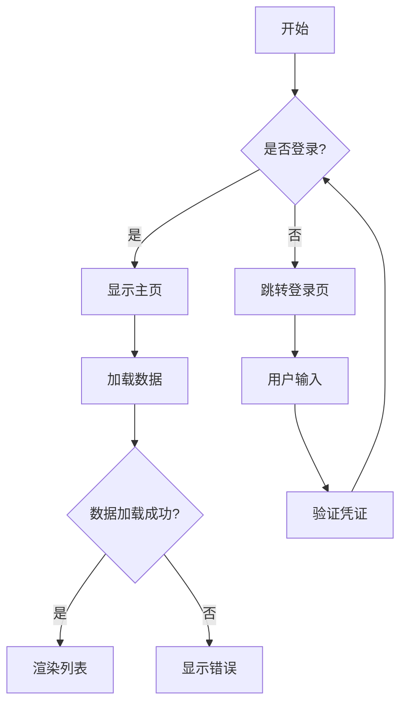
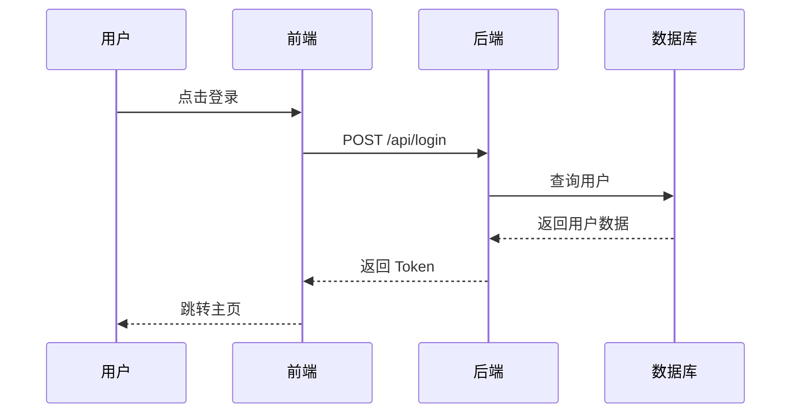
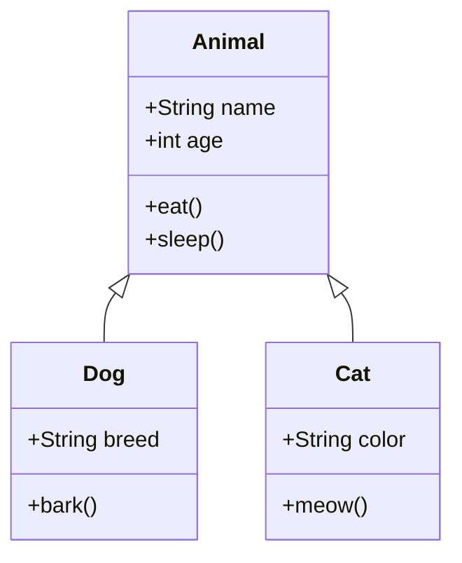
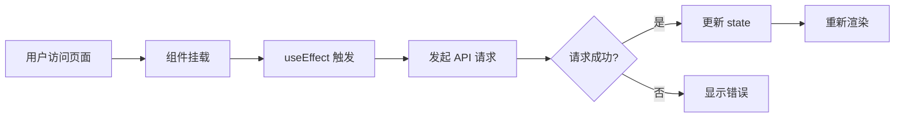

# 代码高亮和图表测试

测试新增的语法高亮、复制代码、Mermaid 图表功能。

## 1. 代码高亮测试

### JavaScript 代码
```javascript
// 这是一段 JavaScript 代码
function fibonacci(n) {
  if (n <= 1) return n;
  return fibonacci(n - 1) + fibonacci(n - 2);
}

const result = fibonacci(10);
console.log('斐波那契数列第10项:', result);
```

### Python 代码
```python
# Python 快速排序
def quicksort(arr):
    if len(arr) <= 1:
        return arr
    pivot = arr[len(arr) // 2]
    left = [x for x in arr if x < pivot]
    middle = [x for x in arr if x == pivot]
    right = [x for x in arr if x > pivot]
    return quicksort(left) + middle + quicksort(right)

print(quicksort([3, 6, 8, 10, 1, 2, 1]))
```

### TypeScript 代码
```typescript
// TypeScript 泛型示例
interface User {
  id: number;
  name: string;
  email: string;
}

function fetchData<T>(url: string): Promise<T> {
  return fetch(url).then(res => res.json());
}

const users = await fetchData<User[]>('/api/users');
console.log(users);
```

### 行内代码测试
这是一段行内代码:`const value = 123;`,应该显示为灰色小标签。

## 2. Mermaid 图表测试

### 流程图


### 时序图


### 类图


## 3. 复制按钮测试

每个代码块右上角都有"复制"按钮:
- 点击后文字变为"已复制 ✓"
- 2秒后恢复"复制"
- 可以粘贴到编辑器验证

## 4. 混合测试

下面是实际项目代码示例:

```tsx
// React Hook 示例
import { useState, useEffect } from 'react';

interface User {
  id: number;
  name: string;
}

export const UserList = () => {
  const [users, setUsers] = useState<User[]>([]);
  const [loading, setLoading] = useState(true);

  useEffect(() => {
    fetch('/api/users')
      .then(res => res.json())
      .then(data => {
        setUsers(data);
        setLoading(false);
      });
  }, []);

  if (loading) return <div>加载中...</div>;

  return (
    <ul>
      {users.map(user => (
        <li key={user.id}>{user.name}</li>
      ))}
    </ul>
  );
};
```

对应的数据流图:



---

**验收标准**:
- ✅ 代码块有语法高亮(不同语言不同配色)
- ✅ 超过5行显示行号
- ✅ 右上角有复制按钮,点击有反馈
- ✅ 行内代码保持原样(灰色小标签)
- ✅ Mermaid 图表正确渲染(流程图/时序图/类图)
- ✅ 图表渲染失败时显示错误提示
